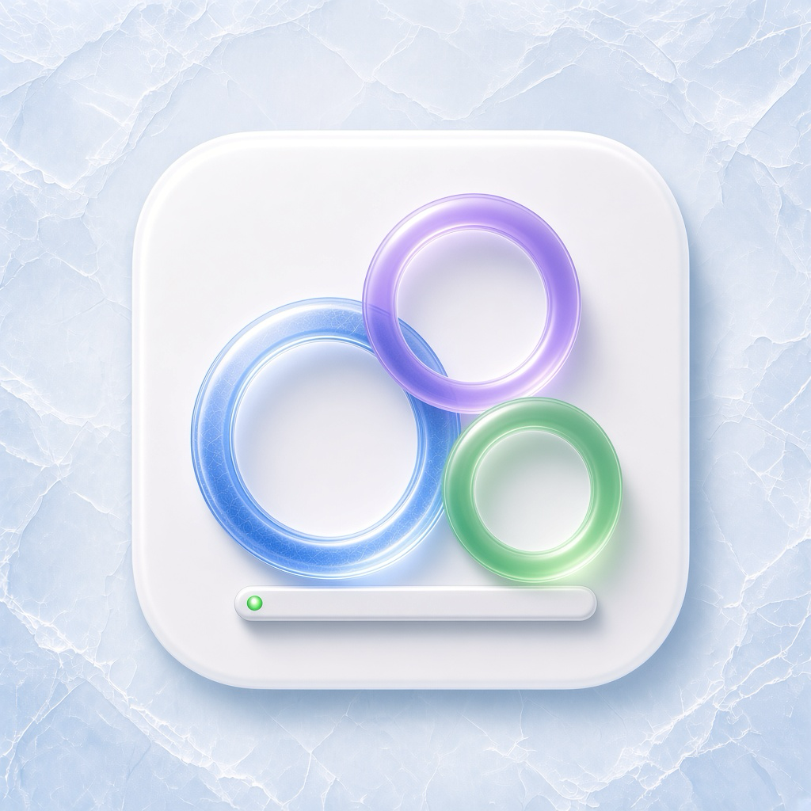
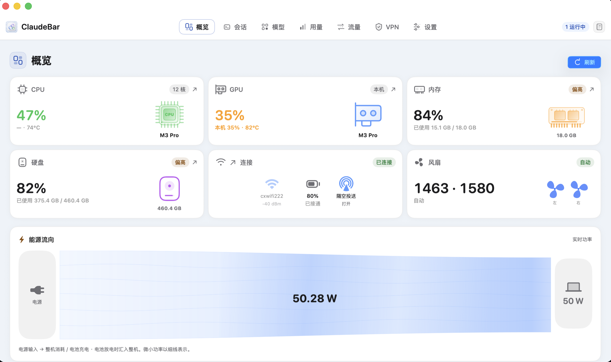
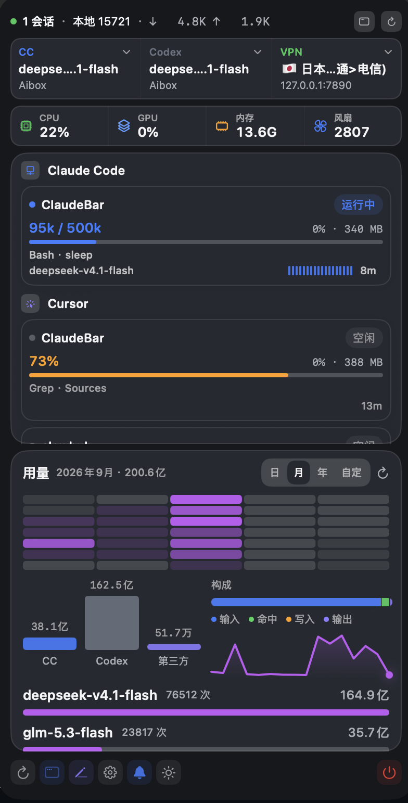
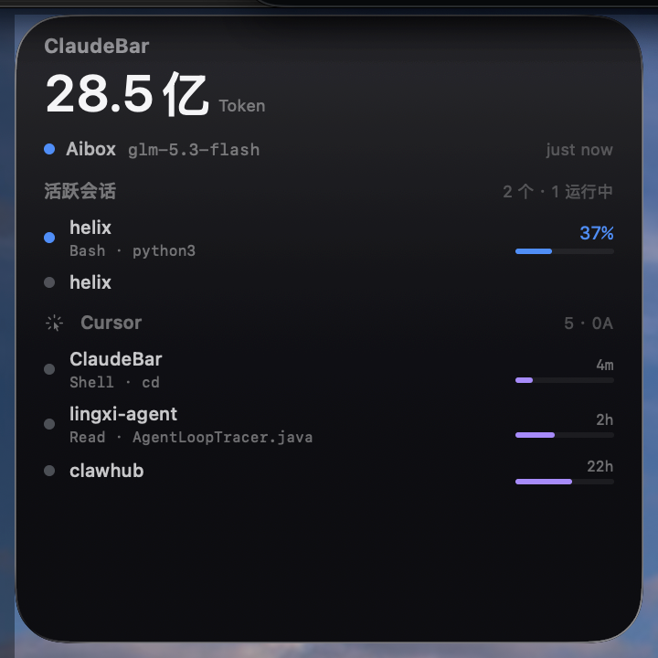

**[English](README.en.md)** | **[中文](README.md)**

<div align="center">



# ClaudeBar

**macOS menu bar — multi-agent model switching, session monitoring, usage stats, and local LLM proxy capture.**

[](https://github.com/wangxiajun68/ClaudeBar/actions/workflows/ci.yml)
[](https://github.com/wangxiajun68/ClaudeBar/releases)
[](https://www.apple.com/macos/)
[](https://swift.org)
[](LICENSE)

[**Download latest release**](https://github.com/wangxiajun68/ClaudeBar/releases/latest)

</div>

For developers running Claude Code, Cursor, and Codex side by side. All data stays local — configs and keys are never uploaded.

## Install

| OS | macOS 15+ · Apple Silicon (`arm64`) |
| Method | Download DMG from [Releases](https://github.com/wangxiajun68/ClaudeBar/releases) → drag to Applications |

```bash
# If Gatekeeper blocks the app
xattr -cr /Applications/ClaudeBar.app && open /Applications/ClaudeBar.app
```

## Core features

<table>
  <tr>
    <td width="52%" align="center">
      
    </td>
    <td valign="top">

**Local LLM proxy** — forwards on `127.0.0.1`, bridges Chat / Responses APIs; with traffic recording, inspect conversations, tool calls, and raw payloads.

**Model switching** — unified Claude Code + Codex configs; one-click activation writes `settings.json` / `config.toml`.

**Sessions · usage · resources** — tri-agent session aggregation, token stats, CPU / GPU / memory attribution.

    </td>
  </tr>
  <tr>
    <td align="center">
      
    </td>
    <td valign="top">

**Menu bar popup** — switch models, scan sessions, check resources and usage without opening the main window.

    </td>
  </tr>
  <tr>
    <td align="center">
      
    </td>
    <td valign="top">

**Desktop widget** — today's token total and active sessions at a glance.

    </td>
  </tr>
</table>

### Quick start

| Goal | Path |
|------|------|
| **Capture traffic** | Settings → local proxy → enable recording on model card → **Traffic** |
| **Switch model** | **Models** page or menu bar popup → activate → open new terminal session |
| **Resume session** | **Sessions** page or popup → click card |
| **Global search** | `⌘K` on any page — search pages / sessions / models |
| **Third-party client** | Base URL → `http://127.0.0.1:<port>/v1` (key injected by proxy) |

## Data & privacy

| Source | Path | Access |
|--------|------|--------|
| Claude Code | `~/.claude/` | Read-only (writes `settings.json` on switch) |
| Codex | `~/.codex/` | Read-only (writes `config.toml` on switch) |
| Cursor | `~/Library/.../state.vscdb` | Read-only |
| Proxy captures | `~/Library/Application Support/ClaudeBar/logs/` | Written when recording is on |

## Build from source

```bash
git clone https://github.com/wangxiajun68/ClaudeBar.git && cd ClaudeBar && make build
```

See [CONTRIBUTING.md](CONTRIBUTING.md) · [docs/RELEASING.md](docs/RELEASING.md) · [FAQ](docs/FAQ.md)

## License

[MIT](LICENSE)
