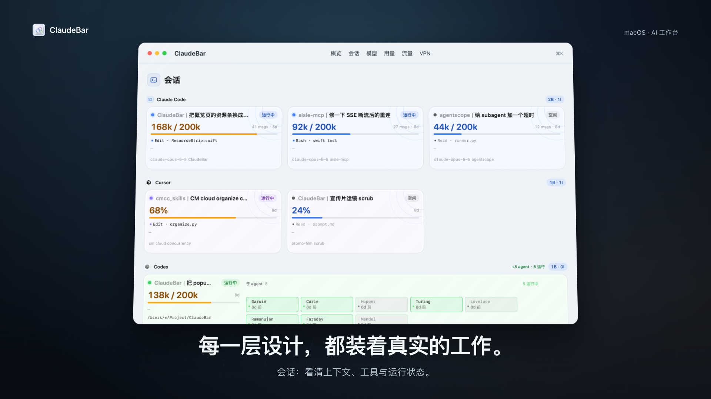
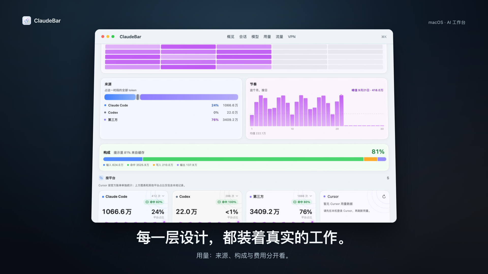

**English** · **[中文](README.md)**

<p align="center">
  
</p>

<h1 align="center">ClaudeBar</h1>

<p align="center">
  A native macOS workbench for AI development.<br>
  Models, sessions, usage, and networking across the menu bar, notch island, and desktop.
</p>

<p align="center">
  <a href="https://github.com/wangxiajun68/ClaudeBar/actions/workflows/ci.yml"></a>
  <a href="https://github.com/wangxiajun68/ClaudeBar/releases/latest"></a>
  
  
  
</p>

<p align="center">
  <a href="https://github.com/wangxiajun68/ClaudeBar/releases/latest"><strong>Download for macOS</strong></a>
</p>

https://github.com/user-attachments/assets/eb0dd190-6cbf-4349-a3c6-a799a273f89e

<p align="center">
  <a href="docs/promo/claudebar.mp4">Download the high-quality film (1080p · 66 seconds)</a><br>
  Chinese interface and captions, matching the app
</p>

---

ClaudeBar gives developers using Claude Code, Codex, and Cursor a unified view of their work. Use the menu bar for quick status checks and model changes, the notch island for agent progress, and the desktop window for session, usage, and request analysis. The app is built with SwiftUI and AppKit.

## Core capabilities

| Module | Features |
| --- | --- |
| Models and providers | Manage Claude Code and Codex models and upstream providers independently; import providers from one runtime into the other. |
| Session monitoring | View Claude Code, Codex, and Cursor sessions, running state, context usage, and tool activity; return to a terminal or Cursor to continue working. |
| Usage analysis | Explore token sources, composition, and activity by day, month, year, all time, or a custom date; view cost estimates and actual Cursor charges separately. |
| Local proxy | Provide a local API endpoint with Chat / Responses conversion; enable recording to inspect conversations, tool calls, images, and raw payloads. |
| VPN and networking | Bundled mihomo with subscriptions, node selection, latency tests, system proxy, and TUN; inspect domains, matched rules, and outbound routes. |
| Connectors | View Skills, MCP servers, and plugins for Claude Code, Codex, and Cursor, plus machine-wide shared CLIs, with details and client-supported enable, disable, and remove operations. |
| Mac status | Monitor weather, CPU / GPU, memory, disk, network, fans, and power; configure a charge limit on Macs with a built-in battery. |

## Three interfaces, one workflow

- **Menu-bar popup:** Check work status, models, allowance, and sessions with fewer window switches.
- **Notch island:** See agent status, completion alerts, and expanded details on supported notched displays.
- **Desktop window:** Access Overview, Models, Sessions, Usage, Traffic, VPN, and Connectors in light or dark appearance.

### Work overview

Weather and greeting, system load, power flow, and active sessions form the desktop overview.

[](docs/promo/overview.png)

### Sessions and usage

Sessions brings together context, tool activity, and running state. Usage shows sources, composition, and activity over a selected period.

[](docs/promo/sessions.png)

[](docs/promo/usage.png)

> The film and images above are rendered from the project source with fixed demonstration data. Models, allowance, and costs illustrate the interface and do not represent actual account data.

## Installation and setup

**Requirements: macOS 15 or later, Apple Silicon (arm64).**

1. Download the DMG from [Releases](https://github.com/wangxiajun68/ClaudeBar/releases/latest).
2. Open the DMG, drag ClaudeBar into Applications, and launch the app.
3. Configure providers and models in Models, then enable the local proxy in Settings as needed and turn on the system features you need under Permissions & Privacy.

Claude Code and Codex model changes update their respective configuration files. **Open a new terminal session after switching to apply the configuration.** Cursor integration provides sessions, usage, and allowance information.

With the local proxy enabled, third-party clients can use `http://127.0.0.1:<port>/v1`; the default port is `15721`, and the proxy requires its local token on every request. Viewing full conversations, tool calls, and raw payloads requires recording to be on: enable request payload recording on the provider for Claude Code / Codex, and use the third-party traffic recording switch under third-party access for other clients. Use ⌘K to jump to pages, sessions, or models, and ⌘⇧A for region capture when that feature is enabled.

For installation blocks, permissions, and integration troubleshooting, see the [FAQ](docs/FAQ.md).

## Data and permissions

ClaudeBar reads session and usage data from each client's local files. Model switching and connector enable/disable operations update configuration through the corresponding client's mechanisms. See [connector documentation](docs/technical/16-connectors.md) for supported operations.

| Source or feature | Main paths and behavior |
| --- | --- |
| Claude Code | Reads `~/.claude/`; model switching updates `~/.claude/settings.json`. |
| Codex | Reads `~/.codex/`; model switching updates `~/.codex/config.toml`. |
| Cursor | Reads `~/.cursor/projects/` and `~/Library/Application Support/Cursor/User/globalStorage/state.vscdb`; retrieves allowance and billing through Cursor endpoints. |
| Proxy records | The access log is written to `~/Library/Application Support/ClaudeBar/logs/`; capture bodies are controlled by a provider's request payload recording or by the third-party traffic recording switch under third-party access. |
| VPN | Core, subscriptions, and configuration are stored in `~/Library/Application Support/ClaudeBar/vpn/`. |

ClaudeBar does not perform model inference. The local proxy forwards requests to configured upstreams; weather, allowance, billing, and subscription features contact their respective services. Connector inventory scans do not start MCP servers. Opening MCP details connects to the service and reads its tool list without invoking tools.

Features requiring system permissions are configured in Settings and authorized through macOS prompts. Proxy recordings may contain conversation and request content; handle them according to your project's data requirements.

**Cost accounting:** Model costs are estimates based on tokens and published list prices, rather than actual invoices. Actual charges returned by Cursor are displayed separately with their applicable time window; amounts with different accounting bases or periods are not combined. CNY and USD are shown side by side by default; switching to a single currency converts at an explicit exchange rate, and falls back to the split display when no rate is available.

## Development and builds

Use macOS, Xcode Command Line Tools (including the Swift compiler), and Python 3. See [development and channel isolation](docs/DEVELOPMENT.md) and [build and signing documentation](docs/technical/07-build-and-signing.md) for dependencies and implementation details.

```bash
git clone https://github.com/wangxiajun68/ClaudeBar.git
cd ClaudeBar
make ci
```

| Command | Result |
| --- | --- |
| `make ci` | Compiles to `.build/dev/ClaudeBar Dev.app` without installing. |
| `make build` | Builds the isolated development app in `.build/dev/ClaudeBar Dev.app`. |
| `make run` | Builds and launches the development app. |
| `make test-fast` / `make test TEST=core` | Runs focused unit regressions without building the app. |
| `make release` | Builds `.build/release/ClaudeBar.app` without installing. |
| `make test` | Runs the project's regression checks. |
| `make package` | Creates the release DMG, zip, and SHA-256 files in `.build/dist/`. |

The [film production specification](docs/promo/prompt.md) documents the storyboard, motion, and rendering workflow. Run `python3 Tools/serve-promo.py` locally, then open `http://127.0.0.1:8808/docs/promo/film.html` for chapter playback.

## Documentation and contributing

[Documentation index](docs/README.md) · [FAQ](docs/FAQ.md) · [Changelog](docs/CHANGELOG.md) · [Contributing](CONTRIBUTING.md) · [Security reports](SECURITY.md) · [Versioning](docs/VERSIONING.md) · [Release process](docs/RELEASING.md)

When reporting an issue, include the macOS version, app version, reproduction steps, and relevant logs. Remove credentials, account information, and sensitive conversation content before sharing.

## License

ClaudeBar project code is licensed under the [MIT License](LICENSE). Third-party components and assets retain their own licenses. Interface icons use Lucide (ISC), with notices in [Lucide.txt](Sources/Licenses/Lucide.txt). Font and other asset notices are listed in [ASSET-LICENSES.md](Sources/ClaudeBar/Resources/ASSET-LICENSES.md). See the [mihomo notes](vendor/mihomo/README.md) for VPN core packaging.
