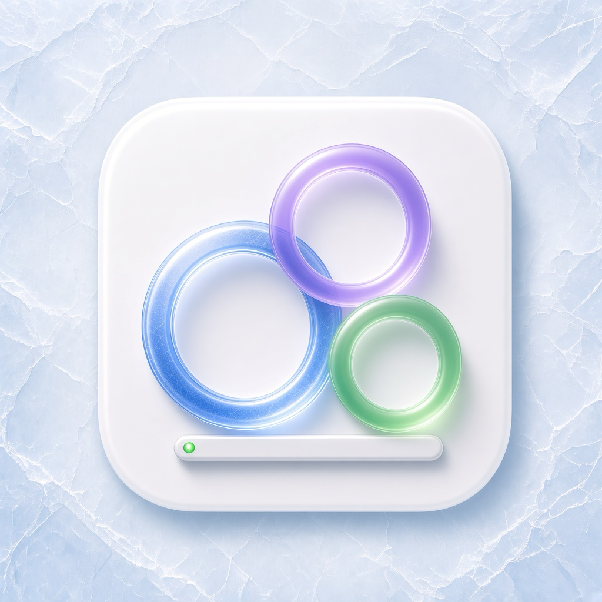
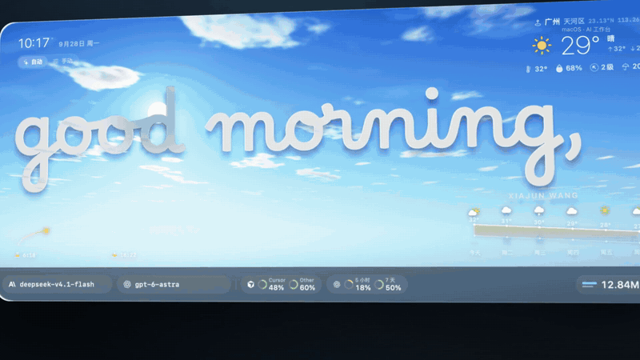
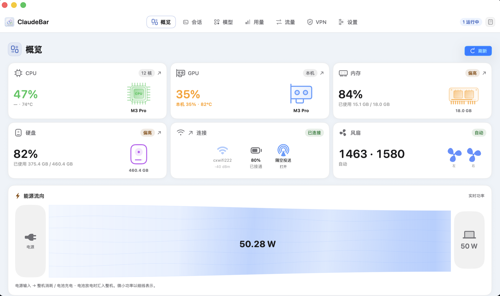
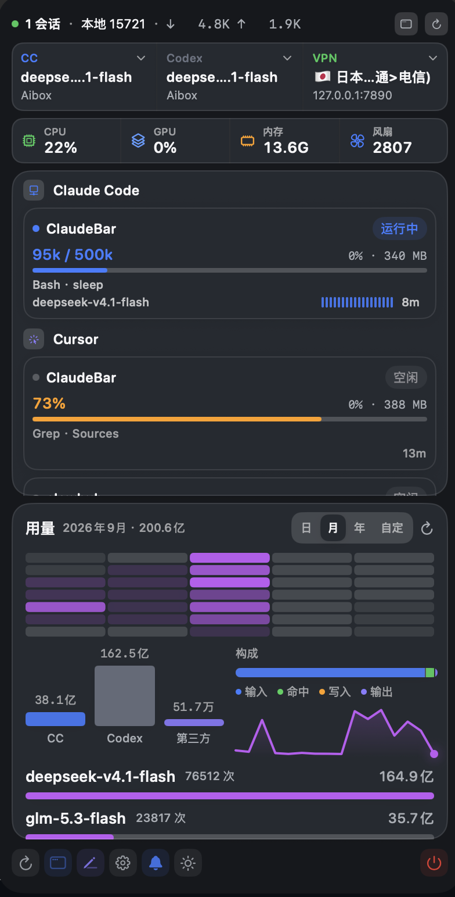

**English** · **[中文](README.md)**

<p align="center">
  
</p>

<h1 align="center">ClaudeBar</h1>

<p align="center">
  The AI workbench in your menu bar.<br>
  Switch models, watch sessions, count tokens, and run a tunnel — while Claude Code, Codex, and Cursor are all open.
</p>

<p align="center">
  <a href="https://github.com/wangxiajun68/ClaudeBar/actions/workflows/ci.yml"></a>
  <a href="https://github.com/wangxiajun68/ClaudeBar/releases/latest"></a>
  
  
  
</p>

<p align="center">
  <a href="https://github.com/wangxiajun68/ClaudeBar/releases/latest"><strong>Download for macOS</strong></a>
</p>

<p align="center">
  <a href="docs/promo/claudebar.mp4">
    
  </a>
</p>

<p align="center">
  <a href="docs/promo/claudebar.mp4">Watch the film</a>
  · the picture is in Chinese, matching the app
</p>

---

Running Claude Code, Codex, and Cursor at once usually means a VPN client, a proxy inspector, and a model switcher sitting next to them. Each one owns a tray icon. Each switch pulls you out of the terminal.

ClaudeBar folds that into one menu-bar app. It stays in the top bar. The main window opens when you want the dashboard.

## What it does

| | |
| --- | --- |
| **Switch** | Claude Code and Codex keep separate vendor lists. Activation writes `~/.claude/settings.json` and `~/.codex/config.toml` independently. The menu bar has three chips — CC, Codex, Cursor allowance — and the VPN node as a pill. |
| **Sessions** | Claude Code, Cursor, Codex, and other CLIs land on one card: context, current tool, heartbeat, CPU and memory. Double-click to resume in the terminal or in Cursor. |
| **Usage** | Model tokens only. Day, month, year, and all-time heatmaps, plus input, cache hit, write, and output. Cost follows published list prices, CNY and USD kept apart. **Cursor's line is a real bill** from its own API, shown separately and never added to the estimate. |
| **Forward** | A local proxy on `127.0.0.1` (default 15721) bridges Chat and Responses. Claude Code and Codex follow the model you just activated. Third-party clients can pick another upstream. The Traffic page keeps conversations, tool calls, images, and raw frames. |
| **Tunnel** | Bundled mihomo: subscriptions, node pick, delay tests, system proxy or TUN. Live rates sit in the menu bar. The VPN page turns each TCP connection into domain, matched rule, and outbound. |
| **Connectors** | One page for the Skills, MCP servers, and plugins installed in the three clients. Read-only. Nothing is launched. |
| **Machine** | An ice or graphite dashboard: load, temperature, disk, network, two fans, and power flow. Light is `#EEF3F8`, dark is `#16181C`. Neither follows the system appearance. Machines with a built-in battery can set a charge limit. |

Also: ⌘K jumps to a page, session, or model. ⌘⇧A grabs a region of the screen. A desktop widget shows today's tokens. On a notched display, the island keeps the running agent.

## Interface

The main window is the dashboard. The menu bar is the same facts, compressed.

<p>
  
</p>

<p>
  
</p>

## Install

**macOS 15+**, Apple Silicon. Download the DMG from [Releases](https://github.com/wangxiajun68/ClaudeBar/releases/latest) and drop it on Applications.

If Gatekeeper blocks it:

```bash
xattr -cr /Applications/ClaudeBar.app && open /Applications/ClaudeBar.app
```

| You want to… | Go here |
| --- | --- |
| Change model | Menu-bar CC / Codex chip, or **Models**. Open a new terminal session for it to stick. |
| Change node | Menu-bar VPN chip, or **VPN**. |
| See if a chat hit the proxy | Settings → local proxy → enable capture → **Traffic** |
| Point a third-party client at the same upstream | Base URL `http://127.0.0.1:<port>/v1`, then pick a vendor in Settings |
| Resume the session you just left | **Sessions**, or the card in the menu bar |
| Grab a rectangle of the screen | ⌘⇧A (can be turned off in Settings) |

## What it touches

Read-first. The only writes into other tools are the ones you trigger by switching a model. ClaudeBar does not run inference. The proxy forwards only to an upstream you already configured.

| Who | Path | Access |
| --- | --- | --- |
| Claude Code | `~/.claude/` | Read; writes `settings.json` on switch |
| Codex | `~/.codex/` | Read; writes `config.toml` on switch |
| Cursor | `~/Library/.../state.vscdb` | Read-only |
| Proxy captures | `~/Library/Application Support/ClaudeBar/logs/` | Written when recording is on |
| VPN | `~/Library/Application Support/ClaudeBar/vpn/` | Subscriptions and core config, local only |

Anything that needs a system permission — widget, notifications, screenshots, automation, Bluetooth, Wi-Fi name, location, Cursor sessions — is off until you enable it in Settings.

## Build from source

```bash
git clone https://github.com/wangxiajun68/ClaudeBar.git
cd ClaudeBar
make build
```

[Contributing](CONTRIBUTING.md) · [Versioning](docs/VERSIONING.md) · [Releasing](docs/RELEASING.md) · [Changelog](docs/CHANGELOG.md) · [FAQ](docs/FAQ.md)

## License

[MIT](LICENSE)

Interface icons are from [Lucide](https://lucide.dev) (ISC), bundled at `Resources/Lucide.txt`. The VPN core, [mihomo](https://github.com/MetaCubeX/mihomo), ships as an `.xz` archive and is unpacked inside the app on first launch.
