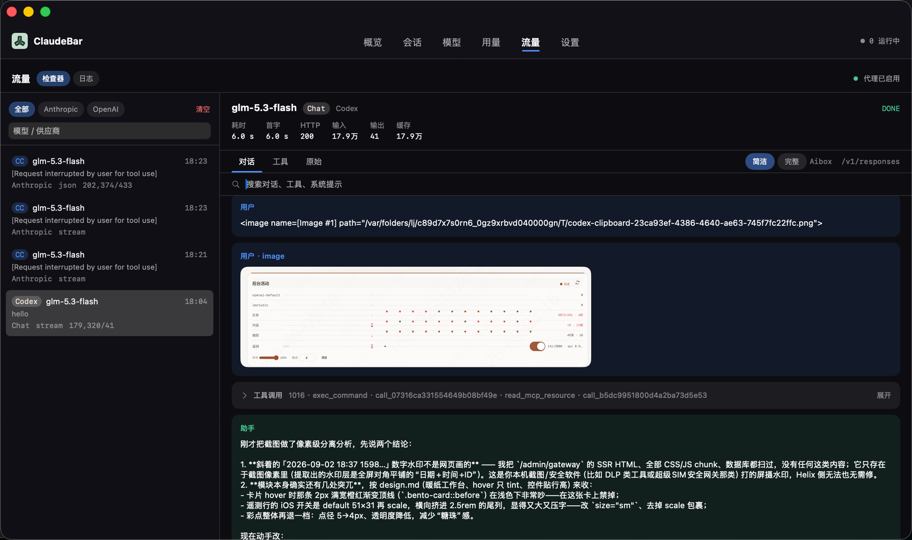

**[English](README.en.md)** · **中文**

<h1>
  
  ClaudeBar
</h1>

macOS 菜单栏 — 多 Agent 模型切换、会话监控、用量统计与本机 LLM 代理抓包。


**[下载最新版](https://github.com/wangxiajun68/ClaudeBar/releases/latest)**

ClaudeBar 面向同时使用 Claude Code、Cursor 与 Codex 的开发者。

## 安装

需要 **macOS 15+**、Apple Silicon (`arm64`)。从 [Releases](https://github.com/wangxiajun68/ClaudeBar/releases) 下载 DMG，拖入 Applications。

Gatekeeper 拦截时：

```bash
xattr -cr /Applications/ClaudeBar.app && open /Applications/ClaudeBar.app
```


## 界面



*流量检查器 · 简洁视图：连续工具调用与系统提示默认折叠，可按关键词搜索对话。*


| 主窗口                                      | 菜单栏 Popup                                  | 桌面 Widget                           |
| ---------------------------------------- | ------------------------------------------ | ----------------------------------- |
|  |  |  |


## 核心功能

- **LLM 本地代理** — `127.0.0.1` 转发请求，Chat / Responses 协议桥接。开启流量记录后可检查对话、工具调用、图片与原始报文。
- **模型切换** — Claude Code 与 Codex 各自维护供应商与模型，互不同步；一键激活分别写回 `settings.json` / `config.toml`。需要拷贝时到管理页手动导入。
- **会话 · 用量 · 资源** — 三端会话聚合、Token 日/月统计、CPU / GPU / 内存归因。
- **菜单栏 Popup** — 模型切换、会话巡检、资源概览与用量，无需打开主窗口。
- **桌面 Widget** — 当日 Token 总量与活跃会话一览。


## 快速上手


| 场景        | 路径                                                        |
| --------- | --------------------------------------------------------- |
| **抓包调试**  | 设置 → 本地代理 → 模型卡开流量记录 → **流量**                             |
| **切换模型**  | **模型** 页分栏选择 Claude Code / Codex，或菜单栏 popup 点击激活 → 新开终端会话 |
| **恢复会话**  | **会话** 页或 popup 点击卡片                                      |
| **全局跳转**  | 任意页面 `⌘K` 搜索页面 / 会话 / 模型                                  |
| **第三方接入** | Base URL → `http://127.0.0.1:<port>/v1`（密钥由代理注入）          |


## 数据与隐私


| 来源          | 路径                                              | 访问                       |
| ----------- | ----------------------------------------------- | ------------------------ |
| Claude Code | `~/.claude/`                                    | 只读（切换时写 `settings.json`） |
| Codex       | `~/.codex/`                                     | 只读（切换时写 `config.toml`）   |
| Cursor      | `~/Library/.../state.vscdb`                     | 只读                       |
| 代理抓包        | `~/Library/Application Support/ClaudeBar/logs/` | 流量记录时写入                  |


## 从源码构建

```bash
git clone https://github.com/wangxiajun68/ClaudeBar.git && cd ClaudeBar && make build
```

贡献指南见 [CONTRIBUTING.md](CONTRIBUTING.md) · 版本与发版见 [docs/VERSIONING.md](docs/VERSIONING.md)、[docs/RELEASING.md](docs/RELEASING.md) · 更新日志见 [docs/CHANGELOG.md](docs/CHANGELOG.md) · 排障见 [FAQ](docs/FAQ.md)

## License

[MIT](LICENSE)