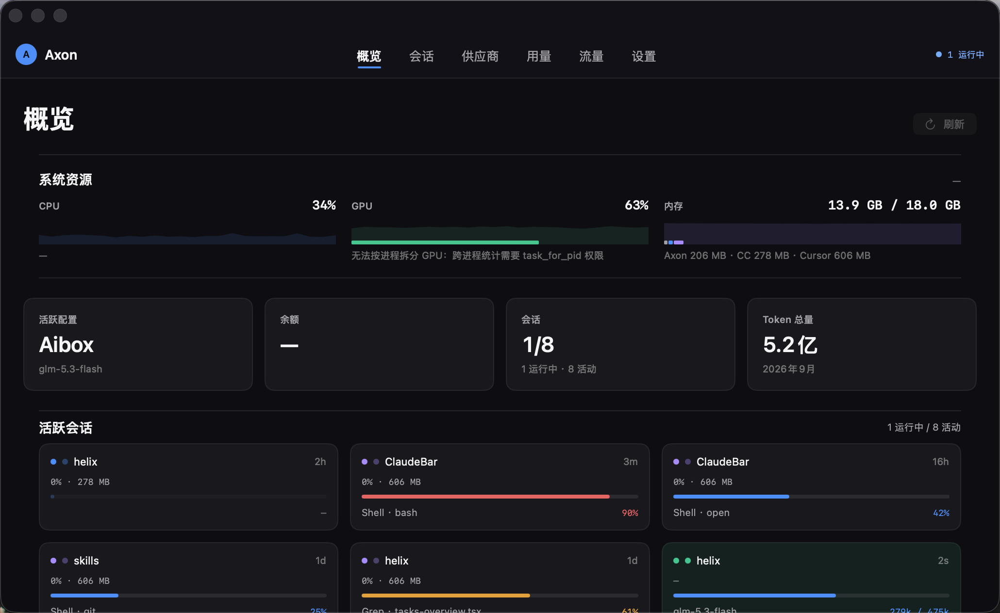

<div align="center">


# Axon

**macOS 菜单栏应用：把 Claude Code / Cursor / Codex 的供应商切换、会话监控与 token 用量放进一块 Liquid Glass 面板。**

仓库目录名仍是 `ClaudeBar`；安装后的 bundle 是 `ClaudeBar.app`，界面显示名为 **Axon**。

[](https://github.com/wangxiajun68/ClaudeBar/actions/workflows/ci.yml)
[](https://github.com/wangxiajun68/ClaudeBar/releases)
[](https://www.apple.com/macos/)
[](https://swift.org)
[](#系统要求)
[](#依赖)
[](LICENSE)

</div>

<p align="center">
  
</p>

## 它解决什么问题

同时使用多家 Claude 兼容服务商，并开着一堆 Agent 会话时，每天要回答三件事：

1. **现在用的哪个供应商？** → 一键切换 Claude Code（写回 `~/.claude/settings.json`）和 Codex（写回 `~/.codex/config.toml`），余额能拉的会直接显示。
2. **哪个会话还在跑？上下文还剩多少？** → Claude Code、Cursor、Codex 会话同屏：状态点、上下文水位、正在执行的工具、busy→idle 系统通知。
3. **这个月烧了多少 token？** → 按日/月/年聚合，按模型分解；主窗口还有本机 CPU / GPU / 内存占用。

## 功能

| 能力 | 说明 |
|------|------|
| 供应商切换 | Claude Code 与 Codex 两套配置；模型列表、base URL、密钥；可选互导 |
| 会话监控 | Claude Code（PID + transcript）、Cursor（`state.vscdb`）、Codex（rollout JSONL） |
| 用量统计 | 持久化日聚合索引；按模型分解；桌面 Widget 当日概览 |
| Codex 本地代理 | 本机 `127.0.0.1` 协议桥接；流量页可检查请求 / 改写 / 响应 |
| 系统资源 | 整机 CPU / GPU / 内存，并标出 Axon、Claude Code、Cursor 占比 |
| 空闲通知 | busy→idle 边沿触发；点按可在终端恢复该会话 |
| 桌面 Widget | WidgetKit systemLarge，App Group 快照驱动 |
| Liquid Glass | macOS 26 原生 `glassEffect`；系统字体 SF Pro / SF Mono；⌘K 命令面板 |

## 安装

### 发行包（推荐）

1. 从 [Releases](https://github.com/wangxiajun68/ClaudeBar/releases) 下载 `Axon-<version>-macos-arm64.zip`。
2. 解压，把 `ClaudeBar.app` 拖到 `/Applications`。
3. 打开一次。若 Gatekeeper 拦截：

```bash
xattr -cr /Applications/ClaudeBar.app
open /Applications/ClaudeBar.app
```

应用为 **ad-hoc 签名**（无 Apple Developer Team ID），不会走公证。仅建议本机或受信任环境使用。

### 从源码构建

```bash
git clone https://github.com/wangxiajun68/ClaudeBar.git
cd ClaudeBar
bash Sources/build.sh        # 编译、ad-hoc 签名、安装到 /Applications、注册 Widget
open /Applications/ClaudeBar.app
```

CI 与发包不要往 `/Applications` 拷贝：

```bash
AXON_SKIP_INSTALL=1 bash Sources/build.sh
AXON_SKIP_INSTALL=1 AXON_PACKAGE=1 bash Sources/build.sh
# → .build/dist/Axon-<version>-macos-arm64.zip
```

打 tag 发布见 [docs/RELEASING.md](docs/RELEASING.md)。

### 系统要求

- macOS 26 (Tahoe) 或更高
- Apple Silicon (`arm64`)
- 从源码构建需要 Xcode Command Line Tools / macOS 26 SDK（`swiftc`）。**没有 Xcode 工程文件。**

### 首次使用

1. 点菜单栏 Axon 图标，或打开主窗口 → **供应商**，添加服务商（名称 / base URL / API key / 模型）。
2. 设为默认：Claude Code 立即写 `settings.json`；Codex 写 `config.toml`。
3. 会话与用量无需配置，自动发现 `~/.claude`、`~/.cursor`、`~/.codex`。

## 依赖

**运行时与构建均无第三方库。** 不使用 Swift Package Manager、CocoaPods、Carthage 或 vendored SDK。

| 链接 | 用途 |
|------|------|
| SwiftUI, AppKit, WidgetKit, CryptoKit, CoreServices, IOKit | 系统框架 |
| `libsqlite3` | 只读 Cursor `state.vscdb`；用量日聚合索引 |

版本号单一来源：仓库根目录 [`VERSION`](VERSION)（当前 **1.8.0**），由 `Sources/build.sh` 写入 app 与 Widget 的 `CFBundleShortVersionString`。

## 数据来源

Axon **不上传**这些文件。除用户主动切换供应商外，会话与用量路径均为只读。

| 来源 | 路径 | 方式 |
|------|------|------|
| Claude Code 会话 | `~/.claude/sessions/`、`~/.claude/projects/` | PID 文件 + transcript tail |
| Claude Code 用量 | `~/.claude/projects/**/*.jsonl` | 日聚合索引 |
| Cursor | `~/Library/.../state.vscdb`、`~/.cursor/projects/` | 只读 SQLite + transcript |
| Codex | `~/.codex/sessions/**/*.jsonl` | rollout 解析 |

写入目标仅限用户操作触发的配置：`~/.claude/settings.json`、Codex 的 `config.toml` / `auth.json`，以及 Axon 自己的偏好与索引文件。

## 项目结构

```
VERSION                             # 发行版本 MAJOR.MINOR.PATCH
Sources/build.sh                    # swiftc 直编 + 签名 + 可选安装 / zip
Sources/ClaudeBar/                  # 主应用
Sources/Widget/                     # WidgetKit appex
docs/                               # 设计 + 技术 + FAQ + 变更记录
docs/images/                        # README 截图
.github/workflows/ci.yml            # macos-26 构建
.github/workflows/release.yml       # tag v* → zip + GitHub Release
```

更细的树见 [docs/design/07-file-structure.md](docs/design/07-file-structure.md)。

## 文档

入口：[docs/README.md](docs/README.md)

| 文档 | 内容 |
|------|------|
| [设计层](docs/design/) | 产品定位、交互与视觉 |
| [技术层](docs/technical/) | 数据访问、状态、构建签名 |
| [FAQ](docs/FAQ.md) | 使用排障 |
| [CONTRIBUTING](CONTRIBUTING.md) | 分支、提交、本地构建 |
| [RELEASING](docs/RELEASING.md) | 打 tag 与 macOS 打包 |
| [CHANGELOG](docs/CHANGELOG.md) | 版本记录 |
| [SECURITY](SECURITY.md) | 漏洞报告与数据边界 |

## 分支与发布

- 默认分支 **`main`**，保持可构建。
- 功能 / 修复：`feature/<topic>`、`fix/<topic>`、`docs/<topic>`，用 PR 合入 `main`。
- 发行：改 [`VERSION`](VERSION) → 写 [CHANGELOG](docs/CHANGELOG.md) → tag `vMAJOR.MINOR.PATCH` → 推送后 [Release workflow](.github/workflows/release.yml) 上传 zip。

## License

[MIT](LICENSE)
