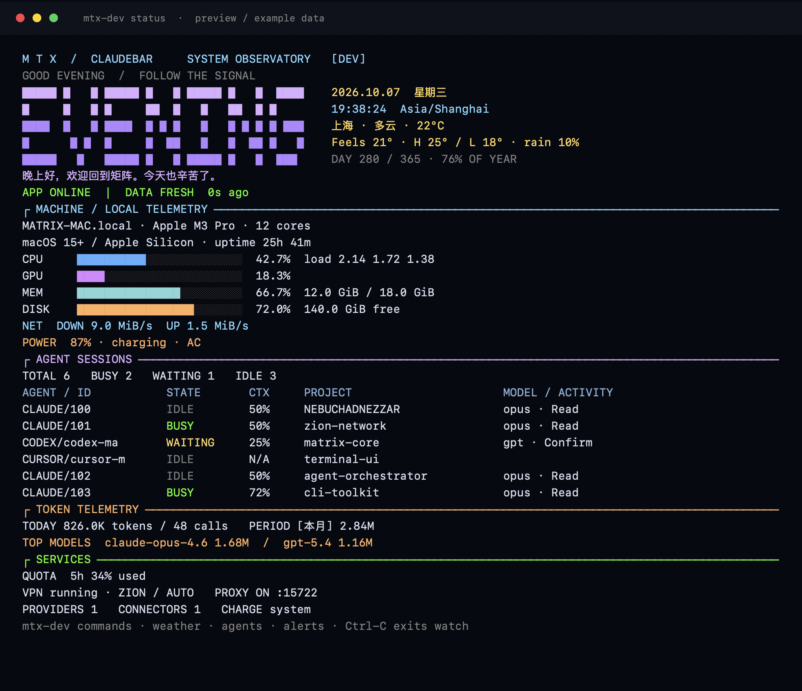

# MTX：Matrix 系统观测台

原生 Swift 命令行客户端，macOS 15+ / Apple Silicon。终端采用青蓝、紫色、琥珀与绿色的语义配色，配合大字时段问候、日期时钟、天气、资源进度条和会话表；不依赖 Python、Node 或 Homebrew。应用和 CLI 复用业务模型，CLI 不重复扫描客户端数据库。



上图由真实 CLI 渲染器生成，使用示例数据；实际状态来自本机采样与对应版本的应用。

## 构建与入口

```bash
make build                              # dev 应用 + 内置 CLI
.build/dev/bin/mtx-dev             # 总览，默认命令为 status
.build/dev/bin/mtx-dev watch       # 实时面板
make cli                                # 仅编译 dev CLI，不启动应用
make release                            # release 应用 + 内置 CLI，不安装
make cli-release                        # 仅编译 release CLI
```

正式版短命令为 `.build/release/bin/mtx`，开发版为 `.build/dev/bin/mtx-dev`。`mtx` 意为 Matrix。原命令 `claudebar` / `claudebar-dev` 继续可用，短名与长名指向同一版本的二进制。CLI 随应用打包到 `Contents/Helpers/claudebar`（开发版 `claudebar-dev`）。

需要直接使用命令名时，显式运行 `make install-cli`（dev）或 `make install-cli-release`（release），同时将短名与兼容长名链接到 `~/.local/bin`。这些命令只构建应用和安装 CLI 链接，不安装、不启动正式版应用，不编辑 shell 配置；若 PATH 不包含该目录，可自行加入。安装器拒绝覆盖别的命令或不属于当前项目的链接。

## 常用命令

下面以开发版为例；正式版使用 `mtx`。

```bash
mtx-dev start                      # 启动同一版本的应用
mtx-dev open sessions              # 打开会话页面
mtx-dev stop                       # 正常退出，应用自行清理
mtx-dev status                     # 本机、会话、用量、服务总览
mtx-dev watch --interval 1          # 每秒刷新；Ctrl-C 恢复原终端
mtx-dev system                     # 本机 CPU/GPU/内存/磁盘/电池/网络
mtx-dev cpu                        # CPU 与负载
mtx-dev gpu                        # GPU 占用，驱动缺数据时 N/A
mtx-dev memory                     # 已用/总内存
mtx-dev disk                       # 主目录所在卷已用比例与剩余空间
mtx-dev battery                    # 电量、充电与电源状态
mtx-dev network                    # 物理接口下载/上传速率
mtx-dev uptime                     # 本机在线时长与芯片信息
mtx-dev greet                      # 大字问候，跟随本地时段
mtx-dev date                       # 本地/UTC 时间、时区、周数、年度进度
mtx-dev calendar                   # 本月日历，方括号标记今天
mtx-dev weather                    # 缓存天气、体感、温差、湿度、风、日出日落、预报
mtx-dev weather refresh            # 请运行中的应用按已配置城市刷新
mtx-dev agents                     # 三种 Agent 的主会话、各状态与子代理统计
mtx-dev models                     # 所选周期模型 Token 排名
mtx-dev alerts                     # 待确认、上下文/额度临界、CPU/磁盘/低电量提示
mtx-dev commands                   # 分组命令目录
mtx-dev sessions                   # 完整主会话列表，不限 Widget 的五条
mtx-dev sessions count             # 仅输出会话数量
mtx-dev count --agent codex
mtx-dev count --status busy
mtx-dev sessions --status waiting
mtx-dev sessions --include-subagents --limit 20
mtx-dev usage                      # 当日与应用选定周期 Token、模型分布
mtx-dev providers                  # 供应商列表、当前选择、模型，不含密钥
mtx-dev quota                      # Codex 账户额度与重置时间
mtx-dev vpn                        # VPN 状态、节点、端口、代理、TUN
mtx-dev proxy                      # 本地 LLM 代理状态
mtx-dev connectors                 # Skills、MCP、插件库存
mtx-dev refresh                    # 请求异步刷新会话/用量/连接器
mtx-dev config                     # 版本隔离、VPN、代理与充电策略
mtx-dev paths                      # 当前版本路径
mtx-dev doctor                     # 只读诊断应用、CLI、快照
mtx-dev help
```

`open` 支持 `dashboard / sessions / providers / connectors / usage / traffic / vpn / settings / help`。可使用 `start --app '/path/to/ClaudeBar Dev.app'` 指定应用；启动前校验 bundle ID 和编译版本。若同一版本已经运行，从已有实例打开，不启动第二个副本。`stop` 使用应用正常退出接口，不发 kill、不强制退出；多个实例时拒绝操作。

数量默认只包含存活的 Claude 会话、Cursor 会话和 Codex 主线程。Codex 子代理不会增加主会话数量；`--include-subagents` 可显式包含它们。`--agent` 和 `--status` 联合过滤；`--limit` 只限制输出行数，不改变匹配数量。上下文不可用时显示 N/A，Cursor 的上下文比例来源与 Claude/Codex 不同，不推算未提供的 Token 数。

大字英文问候随本地时段切换，下面的问候文案沿用应用偏好（应用离线且无快照时显示本地默认文案）。宽终端将时钟与天气排在问候旁；窄终端改为上下排列。`--compact` 收起大字，实时监控的小窗口也会自动使用紧凑头部。CPU 蓝色、GPU 紫色、内存青色、磁盘琥珀色；BUSY 绿色、WAITING 琥珀色、IDLE 灰色，高负载进度条红色。

`alerts` 是读数阈值提示：主会话等待确认、上下文/额度 ≥90%、CPU ≥90%、卷可用空间 <10%、未接电源时电量 ≤20%。阈值提示附带快照时效，离线快照不能当成实时状态。`agents` 默认分列主会话与子代理，`models` 跟随应用选定的统计周期。

## 数据来源与时效

应用每 3 秒在自己版本的 Application Support 目录写 `cli-status.json`。写入使用 `PrivateFileWriter`、0600 权限、原子替换与串行后台队列；最多一个待写快照，慢磁盘不会堆积任务。它不访问 Widget 的 App Group 或其他 App 的 TCC 容器。

快照仅包含显示状态，不包含 API Key、认证文件、代理 token、供应商 URL、MCP 环境变量或会话正文。应用中的模型是唯一会话扫描来源。连接器未扫描时显示 NOT SCANNED，可通过 `refresh` 扫描；空库存不会被误认为已扫描。用量使用应用当前选定的周期，同时提供独立的今日数值；加载期间显示 LOADING。额度缺失显示 N/A。

- `fresh`：应用运行、快照来自当前进程且不超过 15 秒。
- `stale`：应用已退出或快照超过 15 秒，数值仅表示上次记录。
- `unavailable`：尚无快照、不可读、格式错误或版本不匹配。
- `archived`：使用 `--snapshot FILE` 读取存档，仍校验版本身份。
- `invalid-clock`：快照时间明显在未来，不显示为 fresh。

本机数据独立实时采样：Mach CPU/内存、IOAccelerator GPU、文件系统、IOKit 电池、物理 `en*` 网络接口。CPU/网络速率窗口约 150 ms；网络只统计物理接口，避免重复计算 VPN 虚拟接口。磁盘是用户主目录所在卷。驱动不提供 GPU 读数时为 N/A；CLI 不读写 SMC、不安装辅助工具、不索取定位、蓝牙或屏幕录制权限。应用离线时仍可 `system` 或 `status`。

天气复用应用现有 WeatherStore，快照不导出经纬度。观测、抓取时间、来源和天气时区独立保存；超过 15 分钟显示 STALE。尚无天气时显示 N/A，更新中保留旧读数。`weather refresh` 只请求应用按已有天气城市异步抓取，不隐式启动应用、不请求定位权限，不等待网络完成；已有抓取任务时保留该任务，不另排定位刷新，完成后可再次请求；不会写入城市偏好。应用离线仍能使用 `greet`、`date`、`calendar` 与本机命令。

CLI 的 `refresh` 只是请求应用更新，不等待所有网络与数据库扫描结束；成功表示请求已送达，稍后读取新快照。查询命令不会隐式启动应用。VPN、供应商切换、连接器变更和硬件写入继续由原有应用入口管理。

## 自动化与终端兼容

```bash
mtx-dev sessions --json
mtx-dev usage --json
mtx-dev watch --json --samples 3 --interval 2   # 每帧一行 NDJSON
mtx-dev sessions --json --agent codex --status busy
mtx-dev status --compact
mtx-dev status --plain --ascii
NO_COLOR=1 mtx-dev status
mtx-dev completion zsh > /tmp/claudebar-completion.zsh
source /tmp/claudebar-completion.zsh
```

补全脚本同时注册 `mtx-dev` 与 `claudebar-dev`（正式版为 `mtx` 与 `claudebar`）。

JSON 携带 schemaVersion、channel、appRunning、freshness、快照年龄和时间；`sessions` 同时返回数量与列表，`count --json` 返回 counts；纯数字计数使用过期或存档数据时在 stderr 提示时效。错误写 stderr，stdout 不混入日志。watch 的 JSON 为 NDJSON。`--snapshot` 可用于离线诊断私有存档，开发 CLI 不读取正式版快照。

TTY 自动着色，窄终端切换为竖排记录；中文和 emoji 按显示宽度截断。重定向时不输出 ANSI 控制符，不启用全屏。`--plain` 禁用品牌标题与全屏，`--ascii` 使用 ASCII 框线和进度条。watch 收到 SIGINT/SIGTERM 时恢复光标和原屏幕；不产生终端字符雨来遮挡状态。

退出码：0 成功；1 运行错误；2 参数错误；3 缺少应用数据；4 应用生命周期操作失败；130 中断。总览允许在缺少应用快照时显示本机数据；会话、用量等单次专用查询缺少快照时退出 3。watch 则保留监控等待数据出现。

## 验证

`make test TEST=cli` 编译真实 CLI，使用临时夹具验证完整会话数量、过滤、子代理、JSON/NDJSON、过期提示、窄终端、中文宽度、控制字符防护、Ctrl-C 恢复、参数校验、跨版本快照与错误应用启动拒绝；不启动应用，不查询真实代理／硬件，不修改用户配置。
