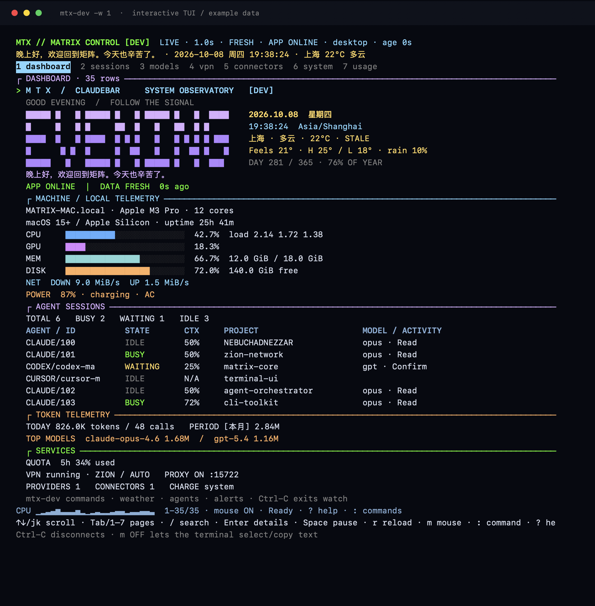

# MTX：Matrix 系统观测台

原生 Swift 命令行客户端，macOS 15+ / Apple Silicon。终端采用青蓝、紫色、琥珀与绿色的语义配色，配合大字时段问候、日期时钟、天气、资源进度条和会话表；不依赖 Python、Node 或 Homebrew。应用和 CLI 复用业务模型，CLI 不重复扫描客户端数据库。


上图由真实 CLI 渲染器生成，使用示例数据；实际状态来自本机采样与对应版本的应用。

## 构建与入口

```bash
make build                              # dev 应用 + 内置 CLI
.build/dev/bin/mtx-dev             # 总览，默认命令为 status
.build/dev/bin/mtx-dev watch       # 实时面板
make cli                                # 仅编译 dev CLI，不启动应用
make release                            # release 应用 + 内置 CLI，不安装
make cli-release                        # 仅编译 release CLI
```

正式版短命令为 `.build/release/bin/mtx`，开发版为 `.build/dev/bin/mtx-dev`。`mtx` 意为 Matrix。原命令 `claudebar` / `claudebar-dev` 继续可用，短名与长名指向同一版本的二进制。CLI 随应用打包到 `Contents/Helpers/claudebar`（开发版 `claudebar-dev`）。

需要直接使用命令名时，显式运行 `make install-cli`（dev）或 `make install-cli-release`（release），同时将短名与兼容长名链接到 `~/.local/bin`。这些命令只构建应用和安装 CLI 链接，不安装、不启动正式版应用，不编辑 shell 配置；若 PATH 不包含该目录，可自行加入。安装器拒绝覆盖别的命令或不属于当前项目的链接。

## 常用命令

下面以开发版为例；正式版使用 `mtx`。

```bash
mtx-dev start                      # 启动同一版本的应用
mtx-dev open sessions              # 打开会话页面
mtx-dev stop                       # 正常退出，应用自行清理
mtx-dev status                     # 本机、会话、用量、服务总览
mtx-dev -w 1                       # 每秒刷新；Ctrl-C 恢复原终端
mtx-dev system                     # 本机 CPU/GPU/内存/磁盘/电池/网络
mtx-dev cpu                        # CPU 与负载
mtx-dev gpu                        # GPU 占用，驱动缺数据时 N/A
mtx-dev memory                     # 已用/总内存
mtx-dev disk                       # 主目录所在卷已用比例与剩余空间
mtx-dev battery                    # 电量、充电与电源状态
mtx-dev network                    # 物理接口下载/上传速率
mtx-dev uptime                     # 本机在线时长与芯片信息
mtx-dev greet                      # 大字问候，跟随本地时段
mtx-dev date                       # 本地/UTC 时间、时区、周数、年度进度
mtx-dev calendar                   # 本月日历，方括号标记今天
mtx-dev weather                    # 缓存天气、体感、温差、湿度、风、日出日落、预报
mtx-dev weather refresh            # 请运行中的应用按已配置城市刷新
mtx-dev agents                     # 三种 Agent 的主会话、各状态与子代理统计
mtx-dev models                     # 所选周期模型 Token 排名
mtx-dev alerts                     # 待确认、上下文/额度临界、CPU/磁盘/低电量提示
mtx-dev commands                   # 分组命令目录
mtx-dev sessions                   # 完整主会话列表，不限 Widget 的五条
mtx-dev sessions count             # 仅输出会话数量
mtx-dev count --agent codex
mtx-dev count --status busy
mtx-dev sessions --status waiting
mtx-dev sessions --include-subagents --limit 20
mtx-dev usage                      # 当日与应用选定周期 Token、模型分布
mtx-dev providers                  # 供应商列表、当前选择、模型，不含密钥
mtx-dev quota                      # Codex 账户额度与重置时间
mtx-dev vpn                        # VPN 状态、节点、端口、代理、TUN
mtx-dev proxy                      # 本地 LLM 代理状态
mtx-dev connectors                 # Skills、MCP、插件库存
mtx-dev refresh                    # 请求异步刷新会话/用量/连接器
mtx-dev config                     # 版本隔离、VPN、代理与充电策略
mtx-dev paths                      # 当前版本路径
mtx-dev doctor                     # 只读诊断应用、CLI、快照
mtx-dev help
```

`open` 支持 `dashboard / sessions / providers / connectors / usage / traffic / vpn / settings / help`。可使用 `start --app '/path/to/ClaudeBar Dev.app'` 指定应用；启动前校验 bundle ID 和编译版本。若同一版本已经运行，从已有实例打开，不启动第二个副本。`stop` 使用应用正常退出接口，不发 kill、不强制退出；多个实例时拒绝操作。

数量默认只包含存活的 Claude 会话、Cursor 会话和 Codex 主线程。Codex 子代理不会增加主会话数量；`--include-subagents` 可显式包含它们。`--agent` 和 `--status` 联合过滤；`--limit` 只限制输出行数，不改变匹配数量。上下文不可用时显示 N/A，Cursor 的上下文比例来源与 Claude/Codex 不同，不推算未提供的 Token 数。

大字英文问候随本地时段切换，下面的问候文案沿用应用偏好（应用离线且无快照时显示本地默认文案）。宽终端将时钟与天气排在问候旁；窄终端改为上下排列。`--compact` 收起大字，实时监控的小窗口也会自动使用紧凑头部。CPU 蓝色、GPU 紫色、内存青色、磁盘琥珀色；BUSY 绿色、WAITING 琥珀色、IDLE 灰色，高负载进度条红色。

`alerts` 是读数阈值提示：主会话等待确认、上下文/额度 ≥90%、CPU ≥90%、卷可用空间 <10%、未接电源时电量 ≤20%。阈值提示附带快照时效，离线快照不能当成实时状态。`agents` 默认分列主会话与子代理，`models` 跟随应用选定的统计周期。

## 控制命令与性能模式

以下示例使用正式版 `mtx`。开发版使用 `mtx-dev`；开发版在客户端和应用端都拒绝 VPN 写操作、系统代理/TUN 变更及外部连接器变更，查询与模式切换仍可用。控制命令要求对应版本的应用已运行，离线时退出 3，可先执行 `start`。

### 启动、退出与界面模式

```bash
mtx start                             # 启动，沿用保存的模式
mtx launch                            # start 的别名
mtx start --mode performance           # 无界面启动；已经运行时直接切换模式
mtx mode                              # 查询实际界面状态
mtx mode performance                  # 进入性能模式，无需重启后台
mtx mode desktop                      # 恢复菜单栏、灵动岛、主窗口和 Dock 图标
mtx restart --mode performance        # 正常退出后重新启动
mtx stop                              # 正常退出，包含已有 VPN 清理
mtx quit                              # stop 的别名
```

性能模式保存在当前版本的偏好中，下次启动沿用；设置页「启动与会话」也有开关。开启后不创建主窗口、菜单栏 popup 或灵动岛，释放现有前端控制器、鼠标监听器、显示计时器和截图快捷键；隐藏 Dock 图标，停止界面资源采样，抑制通知与界面工具入口。`open` 和 Widget 点击无法打开页面，需要先执行 `mode desktop`。`mode --json` 返回实际 `dockIcon / visibleWindows / mainWindow / menuBar / island` 状态。

会话扫描、用量统计、CLI 快照、已有代理和 VPN 后台按原有策略继续运行。切换性能模式不停止这些服务；`stop` 才是退出应用。性能模式也不会绕过开发版的系统集成限制。

### 供应商与模型

```bash
mtx providers catalog                          # 实时配置目录，包含完整供应商和模型 ID
mtx providers list --agent claude
mtx models list --agent codex
mtx providers use '供应商名称' --agent claude
mtx providers use '供应商名称' --agent codex --model '模型名称'
mtx models use '模型名称' --agent claude          # 当前供应商中的模型
mtx models use '模型名称' --provider '供应商名称' --agent codex
mtx providers official --agent claude           # 恢复官方配置
mtx providers official --agent codex
mtx providers capture '供应商名称' on --agent codex
mtx providers capture '供应商名称' off --agent claude
mtx models usage                               # 用量排行；models 默认也显示排行
```

写操作默认作用于 Claude，Codex 必须指定 `--agent codex`。目标接受完整 ID 或精确名称；同名时拒绝切换，要求使用完整 ID。供应商切换默认沿用该供应商已选模型，也可用 `--model` 同时选择。`provider / model` 是 `providers / models` 的别名。Cursor 的模型由原生客户端管理，此处只查询其会话与用量。

### VPN 与本地代理

```bash
mtx vpn status                        # 已发布的运行状态
mtx vpn preview                       # 当前订阅配置的节点及分组，停机时也可查询
mtx vpn nodes                         # 内核运行时的节点、选择、延迟
mtx vpn groups                        # 分组及可选择节点
mtx vpn start                         # 启动 VPN 并启用系统代理
mtx vpn stop                          # 关闭 VPN、代理守护并清理系统代理
mtx vpn restart                       # 等待旧内核释放端口后重新启动
mtx vpn select '节点名称' --group '分组名称'
mtx vpn test '节点名称'                # 延迟测试
mtx vpn reload                        # 重载配置
mtx vpn proxy on                       # 系统代理 on / off
mtx vpn tun off                        # TUN on / off
mtx proxy start                        # 本地模型路由代理 start / stop
```

省略 `--group` 使用主要分组，只允许切换 `Selector` 内已有节点。`preview` 读取当前订阅的配置，`nodes / groups` 查询运行中的内核。VPN 启动等待就绪，系统代理退出清理仍按现有异步流程执行，可随后检查状态。模型代理仍受抓包、Chat API 和会话迁移桥接需求管理；有依赖时 `proxy stop` 会说明原因并拒绝停止。

### 连接器与偏好

```bash
mtx connectors list                           # 实时库存、完整 ID、是否支持控制
mtx connectors refresh
mtx connectors list --project '/path/to/project'
mtx connectors show '连接器名称或完整 ID'
mtx connectors enable '连接器名称或完整 ID'
mtx connectors disable '连接器名称或完整 ID'
mtx connectors remove '连接器名称或完整 ID' --yes
mtx config set appearance dark                # light / dark
mtx config set token-units metric             # chinese / metric
mtx config set weather-city '上海'
mtx config set vpn-guard on                   # on / off
```

`connector` 是 `connectors` 的别名。项目级库存与变更使用同一个 `--project` 目录。连接器控制复用应用的现有批量操作，原生客户端无法管理的项会明确拒绝；需要原生命令的 Cursor 项会在结果标出 `nativeCommand`。删除要求显式 `--yes`，并受连接器自身的可删除能力限制。偏好写入仅支持以上键，性能模式使用 `mode` 命令。

控制命令通过应用进程内的 Unix socket 执行，目录权限 0700、socket 0600，双方校验用户身份、版本通道与请求 ID；dev 和 release 使用各自独立的路径。通道不传递密钥、供应商 URL、连接器环境变量或会话正文。应用串行执行写操作，忙碌时返回明确错误；可同时查询目录与状态。关闭应用会取消尚未完成的控制请求，并仅移除自身拥有的 socket。

控制命令可加 `--json`，返回 `{ok, message, channel, command, result}`。快照查询的 JSON 格式保持不变；控制命令不能配合 `--watch` 或 `--snapshot`。超时表示结果尚不明确，应先查询状态再决定是否重试。

## 秒级刷新与缩写

```bash
mtx -w 1                       # 常驻总览，每 1 秒刷新；Ctrl-C 退出
mtx w 1                        # 同上，watch 的缩写
mtx s -w 1                     # 常驻会话列表
mtx s c -a codex                # Codex 会话数量
mtx pv ls                      # 供应商目录
mtx md u '模型名称' --agent codex
mtx cn off '连接器名称'          # 停用连接器
mtx mo p                       # 性能模式
mtx mo d                       # 恢复桌面模式
mtx on                         # 启动应用
mtx off                        # 正常退出应用
mtx s -w 1 -j -n 3             # 每秒一行 NDJSON，三帧后退出
```

`-w / --watch` 后可选秒数，`watch / w` 也可直接跟秒数；省略时默认 2 秒，范围 0.5–3600 秒。也可继续使用 `--interval / -i` 指定间隔，多个间隔参数按出现顺序取最后一个。无 `--samples / -n` 时持续刷新，Ctrl-C 恢复终端。会话状态来自应用约 3 秒一次的快照，本机资源按 CLI 每帧采样；1 秒刷新不意味着应用会话每秒重新扫描。

### 可交互终端面板



上图由生产 TUI 渲染器生成，使用示例数据；终端字体与主题可能影响实际外观。

输入、输出均为终端时，`mtx -w 1` 默认进入交互面板。顶部固定显示日期、问候、天气、应用状态、数据时效和模式；内容区域滚动，底部显示操作提示与有界 CPU 历史曲线。总览保留大字问候和多色资源条；通过专用页面查看完整列表。刷新保留每个页面的搜索、滚动锚点与选中记录，只重绘变化的行；窗口缩放时重新布局。

| 按键 | 操作 |
| --- | --- |
| `1`–`7`、Tab、← / → | 总览、会话、模型、VPN、连接器、本机、用量页面 |
| ↑ / ↓、`k` / `j` | 移动选中行并滚动 |
| PgUp / PgDn、`g` / `G` | 上下翻页、首行 / 末行 |
| 滚轮 / 触控板 | 支持鼠标报告的终端内滚动；左键选中记录 |
| `/` | 输入搜索，Enter 应用；Esc 取消输入，浏览时 Esc 清除搜索 |
| Enter、Esc | 查看详情和完整 ID，关闭详情；长详情自动换行并可滚动 |
| 空格 | 冻结 / 恢复可见快照；应用与 CLI 后台采样继续 |
| `r` | 模型页读供应商和模型目录，VPN 页读订阅节点预览，连接器页读库存；其他页面重新采样 |
| `:` | 输入一次控制命令，支持现有缩写及引号 |
| `m` | 开关鼠标报告；关闭后可用终端原生选择和复制 |
| `?`、`q` / Ctrl-C | 交互帮助、断开面板 |

目录从现有私有控制通道读取，显示读取时间，按 `r` 更新。`vpn nodes` / `vpn groups` 可读取运行内核的选择和延迟；预览里的未提供字段显示 N/A。目录结果进入对应页面，可以搜索、滚动和查看详情。命令只在提交时执行一次，周期刷新不重复写操作。目录操作需要应用运行；离线 `--snapshot` 禁止发出控制请求。

例如按 `:` 后输入以下内容，Enter 提交：

```text
pv cat -a claude
md u "模型 ID" -a claude --provider "供应商 ID"
vpn pv
vpn s "节点名称" --group "分组名称"
cn ls
cn off "连接器 ID"
mo p
```

模型、VPN 与连接器仍执行原有版本权限检查；删除仍需 `--yes / -y`。命令栏按参数解析，不启动 shell、不展开变量或命令替换；粘贴不会自动提交。启动、退出和重启应用在普通 shell 中执行。控制请求与采样在独立后台队列执行，等待结果时仍可浏览或退出；退出后不要因未看到结果就重复写操作，应先查询状态。

`q` 正常退出；Ctrl-C、SIGTERM、SIGHUP、SIGQUIT 恢复终端输入、鼠标、光标和原屏幕后按中断退出。Ctrl-Z 暂停时先恢复终端，`fg` 后重新进入面板。不同终端的鼠标支持存在差异，键盘滚动始终可用。`--plain / -p`、JSON、数字计数、doctor、管道或非终端输入继续逐帧输出，不进入交互屏幕。

命令使用固定缩写，避免 start、status、stop 等名称的前缀歧义。只展开命令与子命令动词，供应商、模型、节点和连接器的名称保持原样。写操作不能配合 watch，删除仍要求 `--yes / -y`；开发版限制不变。

| 命令 | 缩写 | 命令 | 缩写 |
| --- | --- | --- | --- |
| status / dashboard / watch | st / db / w | sessions / count | s 或 sess / c |
| system / memory / disk | sys / mem / dsk | battery / network / uptime | bat / net / up |
| date / calendar / greet | dt / cal / gr | weather / agents / alerts | wx / ag / al |
| models / providers / quota | md / pv / q | usage / commands | u / cmd |
| proxy / connectors / config | px / cn / cfg | paths / doctor | p / dr |
| start / stop / restart | on / off / rs | mode / open / refresh | mo / o / r |
| completion / version / help | cmp / v / h | CPU / GPU / VPN | 原名已足够短 |

子命令缩写按所在命令解释：

| 命令 | 子命令缩写 |
| --- | --- |
| sessions | ls=list、c=count |
| weather | r=refresh |
| providers | ls=list、cat=catalog、u=use、of=official、cap=capture |
| models | ls=list、cat=catalog、u=use、us=usage |
| vpn | st=status、on=start、off=stop、rs=restart、n=nodes、g=groups、pv=preview、s=select、t=test、r=reload、px=proxy |
| proxy | st=status；on/off 原本即支持 |
| connectors | ls=list、r=refresh、s=show、on=enable、off=disable、rm=remove |
| config | s=set |
| mode | st=status、p=performance、d=desktop |

参数缩写：`-j=--json`、`-i=--interval`、`-n=--samples`、`-a=--agent`、`-s=--status`、`-l=--limit`、`-c=--compact`、`-p=--plain`、`-y=--yes`，保留 `-h / -V`。命令位置的 `s` 是会话命令，参数位置的 `-s` 是会话状态过滤。完整列表见 `mtx help`；`mtx cmd -j` 可读取命令及缩写映射，补全脚本同步支持缩写。

## 数据来源与时效

应用每 3 秒在自己版本的 Application Support 目录写 `cli-status.json`。写入使用 `PrivateFileWriter`、0600 权限、原子替换与串行后台队列；最多一个待写快照，慢磁盘不会堆积任务。它不访问 Widget 的 App Group 或其他 App 的 TCC 容器。

快照仅包含显示状态，不包含 API Key、认证文件、代理 token、供应商 URL、MCP 环境变量或会话正文。应用中的模型是唯一会话扫描来源。连接器未扫描时显示 NOT SCANNED，可通过 `refresh` 扫描；空库存不会被误认为已扫描。用量使用应用当前选定的周期，同时提供独立的今日数值；加载期间显示 LOADING。额度缺失显示 N/A。

- `fresh`：应用运行、快照来自当前进程且不超过 15 秒。
- `stale`：应用已退出或快照超过 15 秒，数值仅表示上次记录。
- `unavailable`：尚无快照、不可读、格式错误或版本不匹配。
- `archived`：使用 `--snapshot FILE` 读取存档，仍校验版本身份。
- `invalid-clock`：快照时间明显在未来，不显示为 fresh。

本机数据独立实时采样：Mach CPU/内存、IOAccelerator GPU、文件系统、IOKit 电池、物理 `en*` 网络接口。CPU/网络速率窗口约 150 ms；网络只统计物理接口，避免重复计算 VPN 虚拟接口。磁盘是用户主目录所在卷。驱动不提供 GPU 读数时为 N/A；CLI 不读写 SMC、不安装辅助工具、不索取定位、蓝牙或屏幕录制权限。应用离线时仍可 `system` 或 `status`。

天气复用应用现有 WeatherStore，快照不导出经纬度。观测、抓取时间、来源和天气时区独立保存；超过 15 分钟显示 STALE。尚无天气时显示 N/A，更新中保留旧读数。`weather refresh` 只请求应用按已有天气城市异步抓取，不隐式启动应用、不请求定位权限，不等待网络完成；已有抓取任务时保留该任务，不另排定位刷新，完成后可再次请求；不会写入城市偏好。应用离线仍能使用 `greet`、`date`、`calendar` 与本机命令。

CLI 的 `refresh` 只是请求应用更新，不等待所有网络与数据库扫描结束；成功表示请求已送达，稍后读取新快照。查询命令不会隐式启动应用。VPN、供应商与模型切换、连接器变更由控制命令调用原有应用入口；硬件写入仍由已有应用功能管理。

## 自动化与终端兼容

```bash
mtx-dev sessions --json
mtx-dev usage --json
mtx-dev watch --json --samples 3 --interval 2   # 每帧一行 NDJSON
mtx-dev sessions --json --agent codex --status busy
mtx-dev status --compact
mtx-dev status --plain --ascii
NO_COLOR=1 mtx-dev status
mtx-dev completion zsh > /tmp/claudebar-completion.zsh
source /tmp/claudebar-completion.zsh
```

补全脚本同时注册 `mtx-dev` 与 `claudebar-dev`（正式版为 `mtx` 与 `claudebar`）。

JSON 携带 schemaVersion、channel、appRunning、freshness、快照年龄和时间；`sessions` 同时返回数量与列表，`count --json` 返回 counts；纯数字计数使用过期或存档数据时在 stderr 提示时效。错误写 stderr，stdout 不混入日志。watch 的 JSON 为 NDJSON。`--snapshot` 可用于离线诊断私有存档，开发 CLI 不读取正式版快照。

TTY 自动着色，普通表格在窄终端切换为竖排记录；交互列表保留单行摘要并通过 Enter 查看换行详情。中文和 emoji 按显示宽度处理。重定向时不输出 ANSI 控制符，不启用全屏。`--plain` 禁用品牌标题与全屏，`--ascii` 使用 ASCII 框线和进度条。

退出码：0 成功；1 运行错误；2 参数错误；3 缺少应用数据；4 应用生命周期操作失败；5 控制操作失败、忙碌或版本限制；130 中断。总览允许在缺少应用快照时显示本机数据；会话、用量等单次专用查询缺少快照时退出 3。watch 则保留监控等待数据出现。

## 验证

`make test TEST=cli` 编译真实 CLI，使用临时夹具和伪终端验证完整会话数量、过滤、子代理、JSON/NDJSON、过期提示、分页滚动、搜索、暂停、缩放、输入解码、目录映射、位置锚点、局部重绘、中文宽度、控制字符防护、Ctrl-C/SIGTERM 恢复、参数校验、跨版本快照与错误应用启动拒绝；不启动应用，不查询真实代理／硬件，不修改用户配置。

`make test TEST=cli-control` 编译真实控制路由与 Unix socket 服务，使用隔离的副作用适配器分别验证 dev/release 版本策略、模型与供应商选择、VPN 和连接器操作路由、模式切换、并发写入、取消、请求身份、端点所有权和秘密字段排除；不启动应用或执行真实系统集成。
