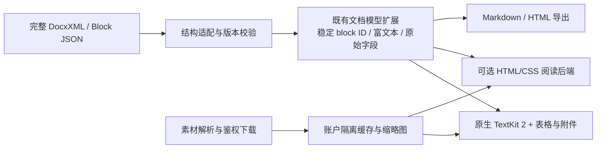

# 飞书文档渲染调研与建议

调研日期：2026-10-03。基于 `codex/session-card-layout` worktree，基线提交 `78802d3`。本轮只调研、读取公开资料和运行合成解析基准，没有读取截图对应的真实文档、改变飞书授权、上传文档或修改渲染业务代码。公开资料的直接请求使用 `http://127.0.0.1:17890` 代理。

## 结论

可以明显改善当前效果，也可以开发自研的高速文档渲染层。推荐先修复数据与素材链路，再渐进替换排版层。

- **复用飞书原界面**：飞书提供官方云文档网页组件。它是最接近原版的路线，不需要重新实现富文本、评论和协作。但它不是可直接链接到 Swift 的原生引擎；macOS 内需要 WebKit 宿主，并验证鉴权与宿主兼容性。
- **自研原生阅读引擎**：保留原生产品方向，读取完整结构，把它转换为应用内部的文档模型，用 TextKit 2 和现有表格组件做排版。可以针对常见文档实现高度相似的视觉与流畅阅读，不能承诺覆盖飞书全部实时协作能力。
- **自研 HTML 阅读层**：完整结构转换为受控 HTML/CSS，再放入单个 WKWebView。复杂表格、分栏、公式更易接近网页效果，但仍需自行处理素材、编辑映射和大文档布局。

不建议把“高速自研”理解为重新实现中文字体塑形、断行、输入法和完整多人编辑系统。应自研文档结构、样式、缓存、增量更新与视口调度，复用系统的文字排版基础。

## 1. 当前实现为什么不好看

### 1.1 读取阶段已发生信息损失

`FeishuDocumentStore.select` 当前调用：

```text
docs +fetch --doc <reference> --doc-format markdown --as user
```

没有要求完整样式和 block 身份。随后 `SkillMarkdownPreview` 把 Markdown/残留 HTML 转成 `DocumentMarkup.LocatedBlock` 再绘制。这适用于通用 Markdown 阅读，不适合作为飞书保真文档的唯一中间格式。

本机 CLI 是 `1.0.95`。帮助明确区分简化、带 ID、完整结构三个级别；当前官方 CLI 源码进一步明确：**Markdown 格式不支持 `full` / `with-ids`，会降回 `simple`**。因此仅在现有命令末尾加 `--detail full` 并不能修复链路。[官方 CLI 实现](https://github.com/larksuite/cli/blob/main/shortcuts/doc/docs_fetch_v2.go)

近期可用的完整读取入口是：

```text
docs +fetch --doc <reference> --doc-format xml --detail full --as user
```

更直接的入口是分页读取原始 Block JSON，并保留文档版本。官方 API 提供父子关系和富文本块；分页需要固定同一版本，避免加载过程中混入另一版内容。[获取文档所有块](https://open.feishu.cn/document/server-docs/docs/docs/docx-v1/document/list)

**完整 XML 也不能直接塞给现有 HTML tokenizer 就算完成。** 当前模型主要维护源字符串范围；没有完整保存远端 block ID、素材 token 和原始未知字段。需要补充结构适配，否则读取更多信息后仍然会丢失。

### 1.2 图片链路没有接上素材鉴权

`SkillMarkdownPreview.swift` 的图片分支：HTTPS 地址直接交给 `AsyncImage`；失败显示“图片暂无法加载”；非 HTTPS 地址显示权限提示。没有飞书素材解析、鉴权下载、有效期处理和专用缓存。

飞书文档图片通常需要素材权限与素材 token 对应的下载链路，不能假设文档中的地址是永久匿名公开 URL。官方素材下载接口要求访问凭证，并有频控。[下载素材](https://open.feishu.cn/document/server-docs/docs/drive-v1/media/download)

因此，换成 WebView 或修改图片占位样式不会自动解决当前图片问题。自研阅读层应通过原生侧/CLI 获取素材，再向渲染层提供本地资源引用。已有官方 CLI 的 `docs +media-download` 可作为接入路径，不必在网页中暴露长期访问凭证。

截图中的具体图片为什么失败，仍需用对应文档确认：可能是权限、过期地址、地址转换或网络问题。本轮没有取得该文档链接，也没有对它执行鉴权请求，不能断言都是 403。

### 1.3 排版规则不一致

源码中可确认：

- 阅读容器上限 980pt；段落、标题、引用另有限制 740pt；列表和部分图片/表格使用不同约束。
- 图片失败后只剩占位与长说明文字，原本的图文节奏随之消失。
- 图片说明/alt 文字可能成为单独的小字号链接；段落和图注采用不同对齐及字号规则。
- 段落、标题、列表、图片的间距由不同分支决定，默认普通块间距为 14pt。
- 表格已经支持列宽、合并单元格和行簇虚拟化，值得保留；行高的回退估算是字符数乘固定宽度，并非准确的字形测量。

这些说明问题不只是颜色或卡片边框，需要统一文档内容宽度、块间距、图文尺寸和数据语义。截图不是飞书原版页面，无法据此测出原版的精确字号和间距；后续应对同一文档取得两侧参考图进行校准。

## 2. 能否直接复用飞书

官方云文档组件的当前接入文档使用 `DocComponentSdk`，支持界面配置、明暗主题和挂载事件。头部、标题、目录等可以通过配置隐藏，因此可以保留 ClaudeBar 外层工具栏，把官方组件用作正文区域。[开始使用](https://open.feishu.cn/document/common-capabilities/web-components/uYDO3YjL2gzN24iN3cjN/introduction)、[功能配置](https://open.feishu.cn/document/uYjL24iN/uYDO3YjL2gzN24iN3cjN/feature-config)

必须注意的实际接入条件：

1. 官方鉴权文档要求企业自建应用，暂不支持商店应用。不能假设现有 CLI 登录身份一定可以直接用于组件。
2. 用户身份按用户文档权限工作；官方入门文档对应用身份的编辑、评论等能力有限制，不能拿应用身份方案替代用户编辑。
3. 需要通过访问凭证取得 ticket，再生成与页面 URL、时间戳、随机串一致的签名。ticket 可在有效期内复用；签名有效期 10 分钟且只能鉴权一次，二者不同。
4. 官方建议 ticket 获取在服务端完成。桌面接入需要原生受控的签名边界；不能简单把 App Secret、访问 token 或 ticket 放进网页。
5. 官方覆盖的是普通 Web 页面；本轮没有确认 WKWebView、`file://` 或自定义 URL scheme 的组件鉴权是否可直接工作。需先验证宿主 origin、签名 URL、登录态、外部跳转和组件加载。
6. 组件要设置固定视口高度。官方明确提示自动高度可能导致全量加载和性能问题。

上述身份及签名条件来自[组件 SDK 鉴权流程](https://open.feishu.cn/document/uYjL24iN/uUDO3YjL1gzN24SN4cjN)。没有必要通过复制飞书压缩 JS、挪用浏览器 cookie 或抓取整个页面 DOM 来接入。

**判断**：如果目标是尽快获得原版编辑与协作，先做官方组件接入验证最合理。如果目标是原生、可控、可缓存的高速阅读，它不是自研引擎的替代品。

## 3. 转换应该怎么做

### 3.1 保真的主链路



Markdown 应作为导出、搜索、AI 上下文和简单草稿格式，不能继续充当所有复杂飞书文档的唯一事实来源。

优先演进现有 `DocumentMarkup`、`DocumentTable` 和 Store，而不是另起一套无法互通的文档架构。内部模型需要保留：

- 文档 ID、版本、block ID、父子顺序与未识别原始字段。
- 富文本运行：粗体、斜体、颜色、链接、公式、mention 等。
- 标题等级、列表嵌套、序号、对齐、折叠状态、代码语言。
- 表格列宽、合并信息、标题行列、单元格内部块。
- 图片 token、宽高、缩放、对齐、说明；附件与白板引用。
- 支持编辑的内容到原始 block/字段的映射。

官方 SDK 当前结构已包含 `Image.scale`、图片宽高/对齐/说明，以及表格列宽和合并信息。因此不能依据早期转换库“无法获取图片缩放”的旧说明来决定现在的实现。[官方 SDK 数据模型](https://github.com/larksuite/oapi-sdk-go/blob/v3_main/service/docx/v1/model.go)

### 3.2 HTML 转换可行，但不等于飞书引擎

可以把内部模型映射成语义化 HTML：标题和段落、嵌套列表、带 `rowspan/colspan` 的表格、分栏、callout、图片与说明。配套自有 CSS 就能建立一致的内容宽度、字号、段距和表格样式。

这里的收益是借助浏览器排版复杂布局，代价是增加 WebKit 文档宿主与交互桥接。直接把 XML 字符串当 HTML 或只导出 GFM，会继续损失语义。开源 Feishu Pages 的转换实现也用附加 HTML 表示 Markdown 无法充分表达的分栏与 callout。[项目自身的格式说明](https://longbridge.github.io/feishu-pages/zh-CN/feishu-docx)

本地 HTML 阅读层可以通过 `WKURLSchemeHandler` 提供应用自己的图片资源，并在取消任务时停止加载。它只能处理 WebKit 不认识的自定义 scheme，不能据此拦截官方组件所有 HTTPS 请求。[Apple 文档](https://developer.apple.com/documentation/webkit/wkurlschemehandler)

完整转换仍然无法凭空恢复原始数据中不存在的字体、特殊应用状态、动态图表、实时 presence 或协作历史。未支持的块应保留原始数据并提供清晰的查看入口，不能悄悄丢掉。

## 4. 自研高速原生引擎的合理边界

TextKit 2 的核心能力是视口布局与渲染，适合在系统文字排版之上实现文档表现层。[Apple 的架构介绍](https://developer.apple.com/videos/play/wwdc2021/10061/)

建议自研这些部分：

- **适配和样式**：完整结构到既有模型；统一排版样式；稳定身份与差异更新。
- **视口调度**：可见区域加预取范围；按段/块缓存布局；宽度变化只失效相关缓存；切换文档取消旧任务。
- **素材服务**：下载合并、限速、过期刷新、失败状态、原始比例占位、按显示尺寸解码和 LRU 缓存。
- **复杂块**：沿用现有表格模型与行簇虚拟化；逐步补齐分栏、callout、代码、图注。
- **增量编辑**：块 ID 和版本驱动的修改；输入法、撤销、选区与定位保持一致。

复用系统实现中文塑形、Unicode/emoji、双向文本、断行及输入法基础。不要把每个段落做成始终存活的独立完整编辑器，也不要在每次滚动时对整篇调用强制布局。

当前 `DocumentInlineEditor` 会通过 `layoutManager.ensureLayout` / `usedRect` 测量编辑块，并访问 TextKit 1 的字形 API。迁移到 TextKit 2 不是把一个构造参数换掉：需要改造测量、光标边界、选择和附件布局，避免触发旧引擎兼容路径。已有表格虚拟化、后台解析、取消机制和缓存应保留。

“单一连续 TextKit 文本流 + 复杂附件”与“复用块视图 + 共享选区协调”都需要原型验证。前者跨段落选择更自然，后者更易复用现有组件；复杂表格、分栏和中文输入是决定边界的测试样本。

## 5. 本机解析基准

提取并直接编译生产 `DocumentMarkup.swift` 与 `DocumentTable.swift`，使用 `swiftc -O`，合成中文段落、加粗和链接，执行解析与目录生成。每个样本运行 7 次，取中位数。无云端、应用启动或系统集成。

| 输入 | 段落数 | 字节数 | 解析与目录中位耗时 |
|---|---:|---:|---:|
| Markdown | 100 | 10,190 | 1.56ms |
| Markdown | 1,000 | 102,890 | 8.33ms |
| Markdown | 4,000 | 414,890 | 29.45ms |
| XML/HTML 段落 | 100 | 9,790 | 2.12ms |
| XML/HTML 段落 | 1,000 | 98,890 | 21.08ms |
| XML/HTML 段落 | 4,000 | 398,890 | 83.45ms |

这些不是首屏时间、滚动帧率或编辑延迟，也不是完整飞书 DocxXML 的保真解析结果。没有图片、复杂表格、公式和深层嵌套；结果不能外推为新引擎已经更快。

基准程序暂存 `.build/feishu-render-research/parser-bench.swift`。当前阅读层还设有 512KB 上限；超过上限不显示内容，不能把这种拒绝加载当成大文档性能优化。

正式比较应给现有实现、原生原型和 HTML 原型同一组脱敏文档，分开记录：

1. 缓存命中/未命中的首屏时间；网络耗时和纯排版耗时分别计量。
2. 快速滚动的帧时间 P50/P95 与卡顿次数；按设备刷新率判断预算。
3. 峰值内存、后台 CPU、视图/图层数量和图片解码占用。
4. 一个段落编辑、中文输入、撤销、宽度切换的延迟与失效范围。
5. 长表格、合并单元格、100 张图片、重复标题、嵌套列表和分栏的视觉与交互正确性。

## 6. 编辑与回写需要单独处理

当前 `FeishuDraft.saveArguments` 对已有文档采用带 revision 的 Markdown 整篇 overwrite。版本检查保留了并发保护，但不等于格式保真：重新建块可能影响 block 身份、复杂块表示和依赖原块的引用关系。未经真实样本文档验证，不能宣称这些信息均会保留。

原生引擎应优先实现保真阅读，再开放已支持块的修改。编辑走稳定 block ID 的字段更新/结构操作，并保留未编辑、未支持的数据；发生版本冲突应重新比较，而不是覆盖远端。官方协作组件则应使用其自身编辑链路，避免与本地 Markdown overwrite 同时编辑同一篇文档。

这意味着“渲染转换”和“可逆的编辑转换”是两个不同的验收目标。只把页面画得相似，不足以证明编辑后能安全回写。

## 7. 路线比较与实施顺序

| 路线 | 原版视觉 | 阅读速度与缓存控制 | 复杂结构 | 原版协作编辑 | 主要成本 |
|---|---|---|---|---|---|
| 完善现有 Markdown 预览 | 有限 | 可控 | 继续受简化格式限制 | 无 | 低，但上限低 |
| 完整结构 → 原生渲染 | 常见块可做到高度接近 | 最有定制空间，需实测 | 逐类实现 | 需另做同步 | 中到高 |
| 完整结构 → HTML/WKWebView | 容易统一网页排版 | 可缓存，需测 WebKit 开销 | 表格/分栏相对容易 | 仍需另做编辑桥 | 中 |
| 官方云文档组件 | 最接近飞书自身 | 主要由官方组件决定 | 跟随组件支持范围 | 用户身份路线最直接 | 鉴权、宿主与网络集成 |

对 ClaudeBar 建议按以下顺序推进：

**第一阶段：修复事实来源与素材。** 完整 XML/Block 读取；扩展已有模型保存身份和媒体元数据；素材下载和比例占位；统一正文、列表、图片与表格的宽度规则。先对用户这篇文档做真实前后对照。

**第二阶段：做两个小原型。** 原生 TextKit 2 阅读层与完整结构 HTML 阅读层，用同一脱敏样本测量。范围是正文、列表、图片、合并表格与分栏，不是完整云文档产品。若优先要求原版编辑，同时独立验证官方组件的企业自建应用与 WKWebView 接入条件。

**第三阶段：选择后端后增量迁移。** 扩展缓存、视口、目录定位、搜索、附件和编辑映射。保留旧路径用于明确的简单文档兼容，不给不支持的复杂文档自动做破坏性回写。

本轮建议的默认方向是**完整结构 + 原生高速阅读层**。它匹配当前 SwiftUI/AppKit 产品以及用户提出的自研目标。HTML 是值得实测的候选后端；官方组件适用于确实需要飞书原版编辑与协作的场景，不需要先复制其私有实现。

开发版继续使用合成文档与素材夹具，不绕过 `FeishuCLI.run` 的 `BuildChannel` 门禁、不读取正式版真实凭据。真实文档及授权联调在显式正式版流程或独立测试环境进行。

## 本轮未验证

- 截图文档的完整结构、素材响应和原版排版参考图。
- 当前飞书应用的身份、组件权限及企业自建应用条件。
- WKWebView 中官方组件的真实鉴权、编辑与协作。
- TextKit 2/HTML 原型的首屏、帧率、内存和编辑性能。
- 复杂文档的可逆转换与回写保真性。

本轮没有修改渲染业务代码，因此没有重新执行应用全量构建；已运行的解析基准不能替代后续渲染与编辑验收。
