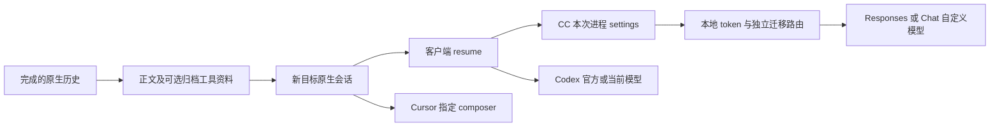

# Codex、Claude Code、Cursor 会话迁移：实现、实测与边界

日期：2026-10-03。工作树：`/Users/wangxiajun/.codex/worktrees/session-migration/ClaudeBar`，分支：`codex/session-migration`。首版提交 `39c6c2f`，第二阶段提交 `db5327a`；本阶段继续在该独立工作树实现，未覆盖原工作区的未提交改动。

## 结论

可以实现跨客户端继续会话。已落地的是：读出完成的历史，建立目标客户端能原生恢复的新会话，保留原项目目录和逻辑关联，再让目标实际回答。已验证 Claude Code（下称 CC）、Codex、Cursor CLI 六个方向；Cursor 桌面的三个来源导入、真实 UI 回答与反向导出；官方与自定义 Codex 的正文分支切换。本阶段还把 Codex 自定义模型到 CC 的协议桥产品化，真实验证 Kimi Responses 和 DeepSeek Chat 的旧事实恢复、工具错误、Read/Write 和新进程恢复。

这能保留任务上下文，但不是搬运运行中的模型、进程、签名思考或权限状态。官方 Codex 历史可以迁入 CC；继续消费同一个 ChatGPT 套餐是独立认证需求，当前没有接入。Cursor 可以继续旧任务，但本次使用其项目模型，未保证沿用来源自定义模型。

本次补齐了 Cursor 指定聊天的直接打开：在已加载窗口中创建新聊天后，通过私有 deep link 直接选择，未重载窗口，旧历史出现且新回答逐字段正确。该行为只承诺已验收的固定版本。

## 当前能力矩阵

| 来源与目标 | 实现和真实验证 | 使用的目标模型／限制 |
|---|---|---|
| CC → Codex；Codex → CC | 首版生产 Swift 适配器、原生 CLI 双向通过 | 官方 Codex 登录或 CC 当前配置；不是共享同一个账号 |
| CC ↔ Cursor CLI | 两个方向及 Cursor 新进程恢复通过 | Cursor Auto；来源通过迁移记录接入，尚无 CLI 全量发现器 |
| Codex ↔ Cursor CLI | 两个方向及原生追加回读通过 | 原生独立会话；Cursor 保存存在延迟，读取有限重试 |
| CC／官方 Codex／自定义 Codex → Cursor 桌面 | 三个来源真实 UI 看到正文并恢复四项事实 | Cursor 3.23.12 项目已登记；本次为 Grok 4.7 Medium |
| Cursor 桌面继续 → CC／官方 Codex | 两个闭环真实 CLI 恢复通过 | 新正文分支；Cursor 原生工具详情未完整导出 |
| 官方 Codex ↔ 自定义 Codex | 新正文分支方案，官方目标及自定义来源有实测 | 不携带另一供应商的私有 reasoning item ID |
| 自定义 Codex → CC，同时沿用该自定义模型 | 本阶段实现；Kimi `kimi-k3` Responses 实测通过 | 选择保存的供应商／模型；ClaudeBar 本地代理须运行 |
| Kimi 来源 → CC，改用另一个 OpenAI 兼容模型 | 本阶段 DeepSeek `deepseek-v4-pro` Chat 实测通过 | 同一历史可以换模型；不是同一模型内部状态 |
| 桥接 CC 产生新工具历史 → 自定义 Codex | Kimi 闭环实测通过，12 条可迁移消息、3 个完成工具 | 工具作为归档文本携带，原始调用不执行第二次 |
| CC／Codex → Cursor 桌面直接定位 | 本阶段真实 UI 通过，不重载窗口 | 私有版本绑定 URL；无登记项目仍要求先创建聊天 |
| 官方 Codex → CC 当前模型 | 已实现且首版真实通过 | 官方凭据不转交 CC |
| 官方 Codex → CC，继续使用官方套餐 GPT | 有官方 SIWC 路径；当前未实现／未验收 | 需要新授权、刷新管理及专用参数／工具适配 |
| 自定义 Codex → Cursor，仍用同一自定义模型 | 历史可迁；同模型接入未实现 | Cursor 自身供应商、BYOK、远程请求路径另外约束 |
| 完成工具内容作为历史资料 | CC／Codex 可选，正负对照及本阶段真实工具闭环通过 | 默认关闭；不迁移工具进程、权限授权或未完成调用 |
| 运行中、权限等待、子代理、压缩、附件、缺失历史 | 当前拒绝，或明确提示非正文遗漏 | 不以静默截断冒充完整迁移 |

历史方向的具体 ID、原始失败与补测见 [首版验收](session-migration-implementation-2026-10-03.md) 和 [第二阶段验收](session-migration-phase2-implementation-2026-10-03.md)。本阶段没有把以前的六方向结果伪称为全部重跑。

## 怎样做到顺畅切换

1. 等当前回合及工具结束，在会话卡片点分支图标「继续于…」。
2. 选择目标。需要自定义模型留在 CC 时选「Claude Code · Codex 自定义模型」，再明确选保存的供应商和模型；官方目标选「Codex · 官方登录」。
3. 查看正文数、工具资料数和遗漏；可选携带已完成工具输入与结果。创建并打开后，目标使用原 cwd／worktree。
4. CC／Codex／Cursor CLI 通过本地原生 resume；Cursor 桌面直接选择新聊天。无需用户复制粘贴大段提示词。
5. 在目标继续。之后从迁移记录打开或再次迁移，保留同一逻辑会话 ID，原会话仍存在。

桥接目标启动时提供本次进程的 `--settings`，而非修改 CC 全局配置。ClaudeBar 重启后，从迁移记录点「继续」重新注册内存路由；单独运行旧 `claude --resume` 不会自动重建桥。模型与供应商变更需重新准备；切换不相关的全局活动供应商不会把此会话偷偷改到别的模型。

目标会重新加载自己的项目规则、工具、权限与账号。迁移不复制 `.claude/settings.json`、Codex auth、keychain、hooks 或 MCP 授权。项目文件本来就在同一 cwd；跨机器还需另做代码／未提交文件同步，本功能没有假装把磁盘也迁走。

## 本阶段真实对话

测试使用自己创建的合成来源和临时项目，实际模型流量按用户允许使用 `127.0.0.1:17890` 网络代理。供应商凭据只在内存读取，不写结果文件；没有改系统代理或 VPN。合成来源先真实回复 ACK，记住随机 marker 和三项约束；回忆问题不包含答案。

### 标准 CC 的两种协议

使用已安装 CC 2.1.288 的正常工具集合，未使用 `--bare`，未关闭原生权限系统。实验指定仅允许临时路径，并为所需 Read／Write／Bash 配置原生许可；生产启动不注入该实验权限。三个检查各启动新的 CC 进程，恢复同一个目标 ID。

| 路线 | 恢复旧事实 | 工具回合 | 新进程恢复 | 原生实际工具／文件 |
|---|---|---|---|---|
| Kimi Responses → CC | 6.78 秒；四项正确 | 26.84 秒 | 4.92 秒；文件内容及 marker 正确 | Read 不存在文件 → Write → Read；1 个错误结果；文件实际存在且内容一致 |
| DeepSeek Chat → CC | 5.71 秒；四项正确 | 22.15 秒 | 4.57 秒；文件内容及 marker 正确 | Read → Write → Read；1 个错误结果；文件实际存在且内容一致 |

三步均 exit 0、`is_error=false`。实际文件为 `BRIDGE-TOOL-PROOF-9157`。该值在 Write 指令中出现，所以这项只能证明工具执行及后续一致性，不能单独证明模型只从工具结果学到内容。

为此另做盲测：测试宿主随机生成 `TOOL-ONLY-9fe6af3e4864479fb691eefd9115a1d6`，仅写入临时 nonce.txt；用户问题只有路径，不包含值。CC 真实 Read 后回答正确（12.44 秒）。关闭进程、重新 resume，不允许工具的回忆问题仍答对（5.26 秒）。没有把摘要或预期值通过问题重新注入。完整原生过程又成功执行 Read／Write／Read。

### 返回 Codex 的闭环

从前面的 Kimi 桥接 CC 会话 `fa6de6f5-e41c-4824-8320-f20b1668b79f` 读取真实新历史，生产读取器带完成工具资料生成新的 Kimi Codex 原生会话 `376d8ef5-0ef9-4397-959d-346932535176`。共 12 条可迁移消息、3 个完成工具；真实 Codex 回复 marker 和文件内容，6.67 秒、exit 0，逐字段一致。

这一步在首次尝试时暴露了 CC 并行工具结果兄弟行问题；修正生产分支读取器后完成，未用手工摘要替代转换。

### Cursor 直接选择新聊天

生产写入器创建 `c7411272-b5d2-4d0c-acbb-05aba16d5227`，随后实际打开：

```text
cursor://anysphere.cursor-deeplink/background-agent?bcId=c7411272-b5d2-4d0c-acbb-05aba16d5227
```

Cursor Agents 窗口在新聊天写入前已经加载。没有执行 Reload Window；URL 选择后看到原问题和 ACK，实际发送回忆问题，Grok 回复四项事实正确。只读生产读取器随后回读 4 条原生消息，含新问题和答案。

这个 pathname 看似 background-agent，但本机 renderer 的 handler 实际发出 `selectAgentRequested`，实测可选择本地 composer。公开 deep link 文档没有承诺该用法，所以实现与版本门禁绑定，并保留历史标题检索作为 fallback。公共链接能力不能推导任意版本都支持本地会话选择。[Cursor 公开 deep links](https://prod.cursor.com/docs/reference/deeplinks)

完整脱敏逐次答案、原生 ID、耗时及保留的失败见 [第三阶段结果 JSON](session-migration-phase3-live-results-2026-10-03.json)。它只收录合成事实，不收录 vendor URL、密钥、登录 token、真实聊天或环境变量快照。

## 关键实现与真实失败的修复



**桥接与会话模型分离。** `AgentProtocolBridge.swift` 只做协议和状态机；`MigrationBridgeConfiguration.swift` 处理保存的供应商选择、指纹、URL 与本次启动 settings；`CodexProxyState` 保存每记录独立路由；`CodexProxyServer` 复用现有 listener 和网络传输。没有另起并行应用架构，也没有新增运行依赖。

**模型和凭据固定。** 路由指纹包含 endpoint、key、wire API、模型和推理强度。记录只存 provider UUID、模型与指纹；上游 key 只在内存。CC 得到本地代理 token；上游只收到所选供应商 key。请求体不能切换路由的模型。准备、继续、启动、注册和请求入口保留 dev 闸，最多注册 128 条内存路由。代理未运行时启动迁移路由禁用全局配置修复。

**流式协议不是仅改字段名。** 系统正文／CC 列表里的 runtime system 转为 instructions；普通 tool_use/result 转为 function_call/output，保留错误资料。Responses 按 output slot 分开文本和工具参数，生成 Anthropic block 开始、增量、结束与终态。Chat 工具名及参数可能碎片化，须先合并，文本仍即时转发。usage 拆分缓存输入，失败、EOF、截断和完成分别处理。它遵循 Messages 的事件生命周期，不制造外部模型无法签名的 thinking。[Anthropic streaming](https://platform.claude.com/docs/en/build-with-claude/streaming)

**并行工具结果不能只沿最后 parent 链找。** 本机 CC 流式助手把多个工具拆成兄弟片段，结果可能各自挂在不同片段下。原读取器把已完成工具误判为 busy。现在仅加入：同会话、非 sidechain、父节点属于所选响应、对应已选调用、调用之后及所选末端之前、只含 tool_result 的行。错误父节点、重复结果、混合正文和其他分支不被拼入；回归覆盖正反例。不会把整份 JSONL 简单按顺序拼接。

**不能把实验工具缺失当成桥故障。** 早期 `--bare` 实验实际只有 Read／Bash，没有 Write，即使工具名在 CLI 参数里出现也不代表注册成功；后来从真实请求工具目录和正常模式查明。正常 CC 的 Write 已实际执行。另一次限定 Bash printf 的实验被 CC 原生权限拒绝，保留失败；没有通过取消安全检查掩盖它。CLI 的 tools 控制可用集合、allowedTools 控制许可、bare 影响启动加载，三者需要分别验证。[CC CLI reference](https://code.claude.com/docs/en/cli-reference)

**标准 CC 的 runtime system 格式。** 初版桥假定 messages 只含 user/assistant；正常 CC 的 custom host 请求还包含 system。初次失败返回 502，使客户端反复重试、最终 160 秒超时。现已保留这些指令，已知不支持输入返回 400、不再误导自动重试；本阶段标准 CC 两个供应商随后全部通过。

**终态与取消。** HTTP/SSE 已开始后只能发 SSE error，不能再写第二个 HTTP status；EOF 不伪造 message_stop。模拟传输证明本地客户端在活跃流中断开时，上游任务取消并断开。上游等待首字节或长期静默时，取消发现仍依赖下一次写入或超时，未声称所有情况下即时取消。`count_tokens` 为本地估算，不冒充精确 tokenizer 或厂商计费。

## 官方和自定义模型怎样继续

**官方 ↔ 自定义 Codex。** 转为新正文分支，每次进程明确指定目标 provider/model；官方分支使用本机已有登录，自定义分支使用已配置供应商。避免原始 fork 携带另一上游认识的 reasoning item ID。调研阶段曾出现原私有 ID 换 provider 后 404，因此不能用“改模型参数后继续同一底层历史”冒充通用无损切换。原来源与新目标由迁移记录关联。

**官方历史 → CC。** 当前已能继续任务：历史进入 CC 新会话，CC 用自己的模型／账号。这个路径不需要把官方登录 token 交给 CC，已有真实证据。

**自定义模型 → CC。** 现可显式沿用同供应商同模型，Responses 和 Chat 分别实测。新工具由 CC 执行、继续写 CC 原生历史；以后可再转回 Codex。只有标准函数工具、文本和已映射格式属于目前验收范围；模型需要专属加密 reasoning／额外 tool namespace 时必须再适配。

**官方套餐 GPT → CC。** 官方现在提供 SIWC 开源 token-sharing 方案，因此技术上不能笼统说不可能。初次使用动态客户端注册、稳定主机标识、loopback 回调、PKCE/state/nonce；验证 ID token 和实际授权范围，并按客户端／账号保护及原子更新刷新凭据。当前登录文件的 scope 不足以直接当新代理授权；原调研 models 请求的 403 是该凭据不足，不能作为整个方案不可行的证明。[OpenAI SIWC sign-in](https://developers.openai.com/siwc/token-sharing-open-source/sign-in)

该路线使用账号可见 `/v1/models` 和公开 `/v1/responses`，需 store=false、stream=true，正确区分完成、额度失败和中断。不得调用 ChatGPT 私有 backend-api 作为替代。[SIWC models and inference](https://developers.openai.com/siwc/token-sharing-open-source/models-and-inference)

SIWC preview 要求完整 input 数组，不能靠 previous_response_id；且不支持 max_output_tokens、temperature、top_p 等目前自定义桥会生成的参数，工具编码也有 preview 限制。因此下一步需单独 SIWC provider/参数工具适配，再真实验证登录、刷新、重启、额度错误和 CC 工具。现有 API key 桥不能直接贴上官方 token 宣称完成。本次没有新增该 OAuth 客户端，也没有发起新的账号授权。[SIWC preview limitations](https://developers.openai.com/siwc/token-sharing-open-source/preview-limitations)

## GitHub 类似实现及取舍

| 项目／一手材料 | 能借鉴什么 | 为什么不足以直接解决全部要求 |
|---|---|---|
| [xhluca/session-migrate](https://github.com/xhluca/session-migrate) | 多客户端原生历史转换、格式探测与能力区别 | 当前说明偏 Linux，Cursor 为固定版本文本支持；不迁移签名推理或认证，工具／压缩／媒体有边界 |
| [Ryu0118/ctxmv](https://github.com/Ryu0118/ctxmv) | CC、Codex、Cursor CLI 历史互转 | CLI 转换不等于 Cursor 桌面选择，也不提供本项目独立身份、事务及固定模型代理 |
| [CC Switch 协议转换源码](https://github.com/farion1231/cc-switch/blob/main/src-tauri/src/proxy/providers/transform_codex_anthropic.rs) | Codex／Anthropic 请求与响应转换的已有工程路线 | 协议转换与原生会话迁移是两个模块；工具状态、认证、计费仍要逐供应商验证 |
| [cursor-workspace-tool](https://github.com/aviv-raz/cursor-workspace-tool) 与 [cursaves 存储说明](https://github.com/Callum-Ward/cursaves/blob/main/docs/how-cursor-stores-chats.md) | Cursor workspace、composer、bubble 与原生状态结构 | 私有 schema 会升级；必须核对本机版本、事务和真实 UI，不能直接全库复制 |

没有安装／运行这些项目或把其未验收承诺搬进产品。历史转换由 Swift 生产函数落地，桥接复用项目已有代理；GitHub 用于比较路线，实际验收以本机原生客户端和真实模型为准。此前更详细的逐平台存储调查、代码交接实验及失败记录见 [深度调研](session-migration-deep-research-2026-10-03.md)。

Cursor BYOK 另受原生支持的供应商、功能和经 Cursor 服务的请求路径约束。本机 127.0.0.1 桥不是远端服务能自动访问的地址；若要同一自定义模型进入 Cursor，还需原生可用 provider 或受保护的远端网关，并重新验证模型目录／工具能力，不应为了迁移直接暴露本地 key。[Cursor API keys](https://cursor.com/help/models-and-usage/api-keys)

## 哪些不好做，以及应怎样做

| 问题 | 当前处理 | 完整实现需要什么 |
|---|---|---|
| 私有思考、加密 reasoning、provider item ID | 不复制，重建正文分支 | 原厂跨模型协议保证；不能自行伪造签名或解密内部状态 |
| 运行中工具／权限确认 | 拒绝，先完成回合 | 独立的进程接管、取消及重新授权状态机；不能把历史写入当进程迁移 |
| 分支、subagent、workflow | 不扁平合并，不完整时拒绝 | 明确选择分支、展示依赖图、独立可读交接；不自动拼错不同分支 |
| 压缩历史、超长上下文 | 拒绝，不截尾 | 保留显式可读摘要、决策／待办／文件证据，目标确认可容纳；这是任务交接能力，需要独立验收 |
| 图片／附件迁移 | 原生历史拒绝；桥的新图像请求仅有映射单测 | 文件生命周期、目标格式、真实模型视觉 E2E；音频／视频不能套文本转换 |
| Cursor 工具详情 | 正文迁移并提示遗漏 | 版本化各工具结构、调用／结果配对及实际反向工具证据 |
| 规则、MCP、权限、账号 | 目标重新加载，认证不迁 | 提示差异并由原生客户端授权，不复制 hooks 或以 settings 重写现有权限 |
| Cursor schema／URL 升级 | 固定版本，未知版本拒绝写 | 新样本、并发事务测试、真实 UI 导入／续聊／反向回读；不能只改版本常量 |
| 同一个 CC 会话直接从任意终端恢复桥 | 通过 ClaudeBar 迁移记录恢复 | 原生启动插件或独立安全引导器；当前没有额外安装常驻服务 |
| 官方套餐跨客户端 | 历史可以迁；同模型授权尚未实现 | 专用 SIWC 流程和范围核验，参数／工具适配与完整真实验收 |
| 所有模型完整工具兼容 | 两供应商已实测 | 按模型建立能力表，加入 MCP、长工具结果、并行、截断、推理及停止行为真实测试 |

源文件 16 MiB、正文 400,000 UTF-8 字节、8,000 条消息；桌面原生状态展开还有额外体积检查。CC 长路径编码超过 200 字符的哈希分支尚未实现；Cursor 项目未登记时不能猜 workspace ID。短合成会话成功不保证所有目标 context window 足够或模型逐字使用全部历史。

## 验证、交付与未验证项

复现回归与构建命令如下。测试依赖复用原工作区现有 venv，只读使用，没有为本任务新增运行依赖。真实模型实验采用独立临时目录、生产 Swift 原生适配器、`Tests/migration_bridge_harness.py` 编译的隔离宿主与实际客户端；不应把回归 fixture 的密钥替换为真实凭据后写入文件。

```bash
make test PYTHON=/Users/wangxiajun/Project/ClaudeBar/.venv/bin/python
make test TEST=session-migration PYTHON=/Users/wangxiajun/Project/ClaudeBar/.venv/bin/python
make test TEST=agent-protocol-bridge PYTHON=/Users/wangxiajun/Project/ClaudeBar/.venv/bin/python
make build
make release
```

| 检查 | 结果 |
|---|---|
| Makefile 唯一完整清单 | 53 组，243.50 秒，全部通过 |
| 最后小改后的迁移 focused 回归 | 1 组，70.54 秒，dev／release／未标记模式通过 |
| 最后小改后的协议桥 focused 回归 | 20.49 秒，通过 |
| dev、release 构建 | 编译、Widget、版本身份、URL scheme、entitlements 与签名通过；未安装 |
| 原生真实调用 | Kimi Responses、DeepSeek Chat、Read／Write／错误结果／冷恢复、盲工具值、返回 Codex、Cursor 直接打开通过 |
| diff／凭据／文档检查 | `git diff --check` 通过；全部 23 个本次文件无已知保存凭据或实验 token，文档本地链接有效 |
| ClaudeBar App 全流程手工点验／安装 | 未执行；仅构建和生产函数／原生客户端实测 |
| VPN、DNS、TUN、SMC、特权工具、登录项、真实 Codex app-server | 未运行／未改动 |

完整回归完成后，最后调整了桥的输入错误分类／提示和本地 URL 回归，另补跑对应 focused 回归，并重新构建固定源码。先前 release 编译因源码在编译期间更新而被 Swift 拒绝，该次不算构建成功。基线 VPN 模块的 actor／try 和 linker rpath 警告未在本任务修改。

生产 App 的 dev 系统集成闸始终保留；真实实验使用从生产源码编译的独立 release 适配器和自己创建的合成目标，不以环境变量打开 dev 真实客户端。HTTP 测试宿主只替代 listener 生命周期和上游 fixture，协议、认证、路由、写入及网络读取直接执行生产源码切片。测试代理参数仅在独立实验宿主，不属于应用开关。

没有执行正式安装、发布或提交 PR。产品契约见 [session-migration.md](../technical/session-migration.md)。完成的上下文迁移和已验证的自定义模型桥可在显式正式版手工验收后投入使用；官方套餐、媒体、压缩与所有供应商通用兼容仍按上面的边界管理。
