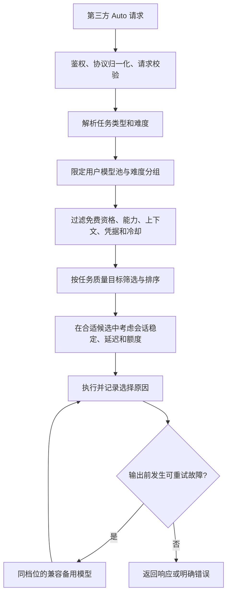

# 模型任务路由：调研与设计建议

调研日期：2026-10-09。状态：**本地任务规则基线已实现；训练／LLM 语义分类器、任务能力评分和会话黏性仍是设计建议**。当前已实现能力见 [Auto 网关使用说明](../LLM_GATEWAY.md)。后续实现已将缺省难度改为本地自动判断，显式覆盖优先；本文件其余高级机制不应视为已实现。

## 结论与当前差距

合适的模型需要同时满足任务质量和运行约束。现有网关提供手动难度分组、上下文／工具／图片／JSON 过滤、供应商和模型冷却，以及顺序／轮转／延迟选择，并已补充本地用户目标规则判断；尚不能像训练分类器一样预测模型的任务质量。

当前 `GatewayRequirements.init(chat:)` 在缺少 `task_difficulty` 时调用 `GatewayTaskRouter`；信息不足时采用 medium，同档位无兼容模型时允许向上寻找候选；`FreeModelGateway.begin` 在满足硬约束后按故障、最近使用和响应头延迟排序。这些是可用性与负载分配信号，HTTP 200 不能作为回答正确、代码通过测试或工具选择合理的质量证据。新模型默认支持所有难度也不代表它有应对高难度任务的实测能力。

## 参考方案

| 来源 | 官方公开的机制 | 适合本项目的部分 |
| --- | --- | --- |
| Cursor Router | Balance / Intelligence 在每次 Agent 请求前分类任务类型和复杂度，并结合模型表现选择；Cost 沿用旧 Auto 的逻辑。公开文档未提供可直接复现的训练数据和完整分类算法。 | 请求级分类；将质量目标与轮转策略分开；不把关键词规则声称为 Cursor 同款分类器。[官方文档](https://cursor.com/docs/cursor-router) |
| Microsoft Foundry Model Router | 使用训练过的语言模型分析任务、复杂度和推理需求，支持 Balanced / Cost / Quality，以及限定候选模型子集。 | 先预测质量是否达标，再优化资源；不同目标下使用不同选择标准。[概念文档](https://learn.microsoft.com/en-us/azure/foundry/openai/concepts/model-router) |
| Anthropic Agent 工作流 | 将输入分类后交给合适的模型或专门流程，分类器可以是 LLM 或传统算法；适用前提是任务类别可区分且分类足够准确。 | 分离分类与任务执行，允许轻量模型承担容易任务。[工程指南](https://www.anthropic.com/engineering/building-effective-agents) |
| OpenRouter Auto Router | 提供请求级选模；当前文档描述每轮重新排名，历史模型仍在优选候选内时优先复用，任务变化时允许换模型。 | 有条件地保持会话模型稳定；不能把它直接当成跨供应商的免费模型池。[官方文档](https://openrouter.ai/docs/guides/routing/routers/auto-router) |
| RouteLLM | 使用偏好数据训练强／弱模型之间的质量与成本选择，并以评测检查效果。 | 通过任务评测校准阈值；规则或模型自评不等于已验证质量。[论文](https://arxiv.org/abs/2406.18665) |

Cursor 旧版 2025 年模型选择指南与新版 Router 的描述不同，设计以当前 Router 文档为准。厂商公开指标不直接外推到 ClaudeBar 的免费模型池。

## 建议的决策链

### 1. 请求理解

继续让明确的 `task_difficulty` 优先；自动模式不能覆盖用户指定档位。现在缺少难度时调用本地规则判断，判断来源与选择原因在状态页可见。没有兼容候选时仅自动估计可向上寻找；显式覆盖保持严格匹配。

分类至少分成两个维度：

- 类型：编码、排错、规划／推理、信息提取、写作、视觉、通用。
- 难度：low / medium / high，并记录分类来源和不确定性。

分类依据最新用户目标、必要的会话背景、是否进入工具执行阶段及任务约束。输入字数用于上下文容量判断，不能直接当难度；一句简短的并发故障问题可以很难，一段很长的结构化提取任务也可能很容易。工具数量、代码块数量和模型名字也不能单独决定难度。只有工具输出或“继续”的请求需要沿用已有任务背景。

本地规则可作为低延迟基线和故障兜底，但应标记为“规则判断”。语义分类可用用户选定的小模型，通过现有 HTTPS 传输、凭据引用、额度与取消机制发起一次有严格输出结构的请求，返回类型／难度／不确定性，不生成任务答案、不调用工具、不自行选供应商。分类器消耗免费请求额度，应设时间与输出上限并避免递归进入 Auto。

分类器失败或不确定时使用可解释的保守策略，明确显示兜底来源。模型自报的 confidence 不能当成经过校准的概率。是否足以放到默认自动模式，需要任务样本评测验证。

### 2. 候选模型的任务画像

保留现有难度复选框、能力开关和供应商 UUID 引用；补充模型擅长的任务类别、用户优先级和评测记录。目录拉取能证明公开能力与价格信息，不能证明推理、编程或规划质量；不可仅凭模型 ID、参数规模、厂商名字自动赋予高评分。

任务质量画像的证据分开保存：手动配置、固定样本评测、客户端提供的实际任务反馈。未评测时显示未知，使用用户配置的优先级，不制造“质量 95 分”一类伪精度。通用与专长都允许多选，避免把适用性限制为单一类型。

### 3. 先质量门槛，再运行优化

候选集始终受用户模型池、手动难度、上下文与输出容量、工具／视觉／JSON 能力以及免费资格限制。冷却、缺少凭据和已下架模型仍排除。自动估计无兼容候选时可以明确记录并向上选档；显式覆盖无同档位兼容候选仍返回明确错误，不静默改变覆盖或落到付费上游。

再按任务画像设质量目标：

- 快速：在能够完成任务的候选里优先低延迟、低 token 消耗。
- 均衡：满足质量门槛后考虑延迟、可用额度和会话稳定。
- 质量：优先该任务类别中质量证据最强的模型。

这些是拟新增的优化目标，不能把现有“均衡轮转”改个名字就声称实现了质量路由。免费池的标价都可能为零，资源优化主要是免费额度、生成 token、等待时间和冷却；目前无法获取的平台剩余额度应标记未知，不推测为无限。分类器的时间与额度同样计入。

### 4. Agent 会话稳定与能力边界

拟支持客户端显式 session_id，并将其仅用于网关会话选择；不透传给不支持的上游。缓存只保留有上限和过期时间的会话标识／选择元数据，不在路由状态里保存提示词正文。

在同类任务、同档位、能力与质量仍合适时优先复用模型。用户进入新任务、难度变化、上下文超过容量、模型冷却或证据表明其他模型明显更合适时重新选择。工具调用与对应结果之间尽量保持模型稳定；“继续执行”不应因为文本短而降级。

网关只能看 API 请求、响应和客户端显式反馈，不能知道代码是否通过测试、用户是否接受结果或外部工具是否完成了目标。HTTP 故障、回答质量不足和 Agent 执行失败应分开。客户端拥有工具执行与任务状态，因此质量升级宜作用于下一次请求；已有输出不能由网关悄悄重放，工具返回一个错误也不自动视为模型差。

### 5. 可解释的模型页

在模型池添加任务专长与画像证据；在路由记录展示本次类型、难度、显式／分类／兜底来源、最终模型以及选择或跳过原因。例如“规划 · high · 分类判断；选择池内 high 规划模型；A 处于冷却，B 上下文不足”。说明使用规则判断或未知质量时，不夸大智能程度。

难度、优化目标、现有轮转／延迟策略分开表达；高级选项收起，以避免给普通客户端增加必填入参。

## 实施与验收顺序

1. 新增独立请求分析结果，保留手动难度覆盖和旧配置兼容；给规则基线建立覆盖长而简单、短而复杂、工具续轮等样本的回归。
2. 增加任务画像与证据来源、任务匹配排序和路由原因；再接入有界会话选择。复用现有 actor、store 与私密存储，不建立另一套供应商管理系统。
3. 接入可选语义分类器，覆盖超时、不可用、无效 JSON、非法标签、低置信度、额度不足、取消与不会递归调用自身的情况。
4. 用固定合成任务评估分类准确率、错误降档率、任务完成率、有效 JSON／工具响应、首 token 与完成延迟、总请求与 token 额度。将结果与固定模型、现有轮转基线比较；仅通过传输回归不足以证明智能路由有效。[Foundry 的评估指导](https://learn.microsoft.com/en-us/azure/foundry/openai/how-to/evaluate-model-router)也强调根据实际工作负载检查质量、成本、延迟与模型分布。

发布验收仍沿用仓库 dev / release 隔离和测试门禁，不读取或复制正式版凭据，不用真实 VPN 或外部客户端配置来做回归。真实推理评测应使用明确配置的评测账户和额度。
